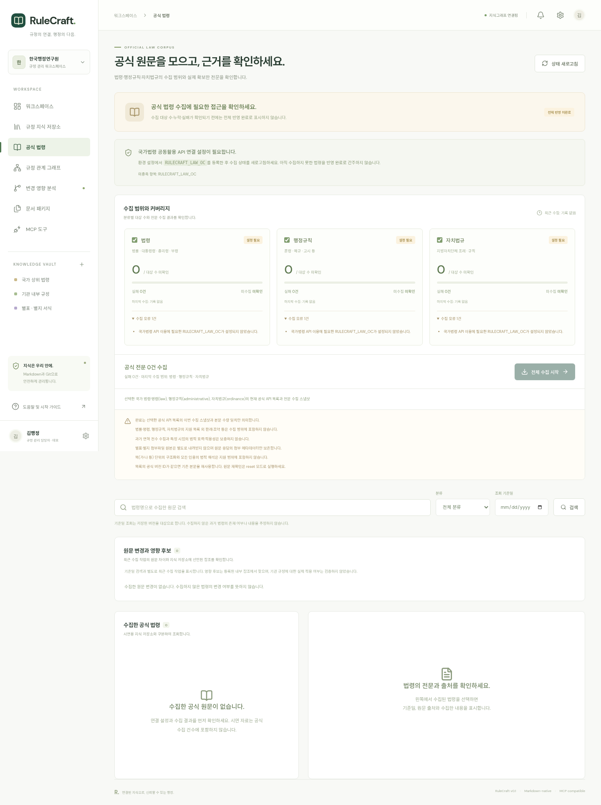
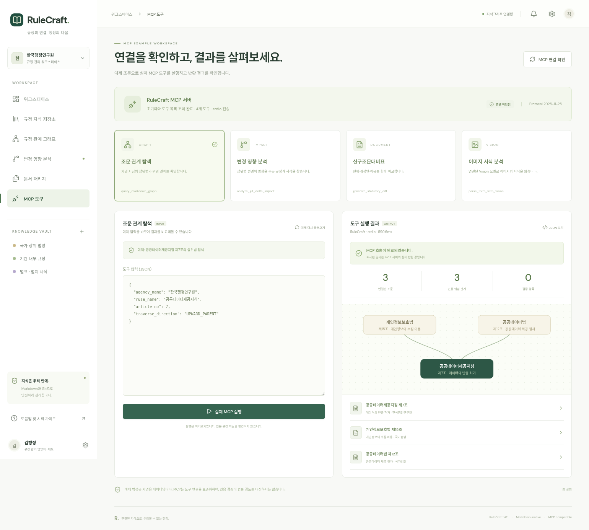
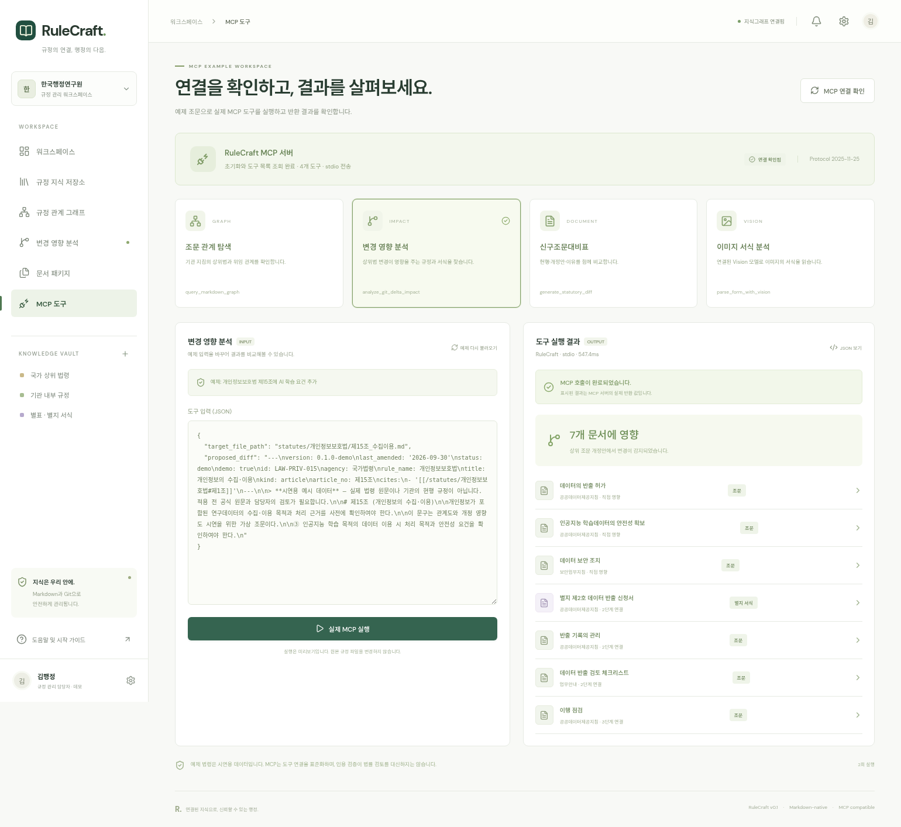
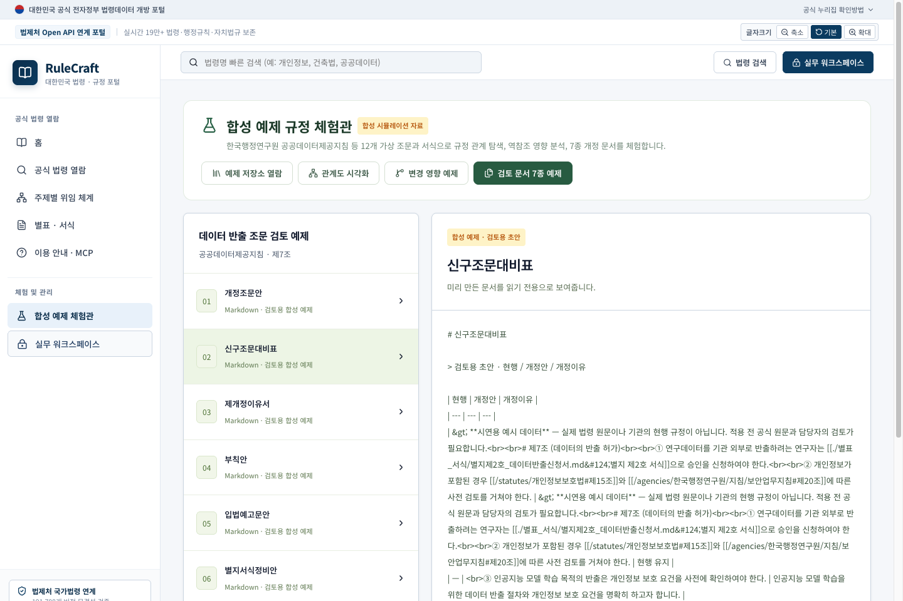

# RuleCraft

공식 법령 원문과 기관 Markdown 규정집에서 근거를 조회하고, 개정 초안의 인용과 변경 영향도를 검사하여 검토 문서 패키지를 만드는 웹 작업 공간입니다.

## 웹 배포

프런트엔드의 공개 읽기 전용 시연은 **[https://raw-ecru.vercel.app](https://raw-ecru.vercel.app)**에서 볼 수 있습니다. GitHub `main` 변경을 Vercel이 자동 배포하며, 실제 발급된 주소의 익명 접근을 확인했습니다. 실제 API 연동은 백엔드 서버의 접근 가능한 HTTPS 주소를 준비한 뒤 진행합니다.

[Vercel에 GitHub 저장소 연결](https://vercel.com/new/import?s=https%3A%2F%2Fgithub.com%2FJaehunReal%2Fraw) · [공개 시연 안내](docs/public-preview.md) · [운영 백엔드 연결 요건](docs/deployment.md)

공개 시연에는 합성 규정 12개·관계 31개·검토 문서 7개와 MCP의 기록된 실행 결과가 표시됩니다. 검색·원문 열람·관계 탐색은 브라우저에서 동작하며, 저장·공식 수집·실시간 MCP는 백엔드 연결 준비를 기다립니다. 공개 시연 배포에는 API 키나 비밀번호가 필요하지 않습니다.

국가법령정보 API 계정은 백엔드에 설정합니다. 백엔드 인증 토큰은 백엔드와 Vercel의 서버 환경에 같은 값으로 등록하며, 브라우저 코드에 넣지 않습니다.

백엔드를 연결할 때는 [배포·인증 설정 안내](docs/deployment.md)를 따르세요. 서버를 시작하기 전에 `uv run --env-file .env --project backend --frozen python scripts/check-law-api.py`로 법령·행정규칙·자치법규의 소량 목록과 본문 조회를 확인할 수 있습니다. 결과는 전체 수집 완료를 뜻하지 않으며, 저장소를 변경하지 않습니다.

## 공식 법령 전체 목록·전문 수집

**공식 법령** 메뉴에서 법령·행정규칙·자치법규의 전체 목록과 전문을 수집하고, 종류별 누락·실패·진행 상황을 확인합니다. 원문은 시연 규정집과 분리된 SQLite 색인과 원본 응답으로 보관하며, 공식 식별자·버전·공포/시행 정보·출처·수집 시각·해시를 함께 저장합니다. 재실행 시 실패한 전문을 다시 수집하고 기존 버전을 보존합니다.

수집한 원문을 법령명·본문·기준일로 조회하고 입안 모델과 검토 보고서의 근거로 사용합니다. 원문 변경은 등록된 기관 규정의 인용·역참조를 따라 영향 후보를 조회합니다. MCP 조회도 `source_scope: "official"`로 공식 조문을 사용할 수 있습니다. 시연 자료는 **시연**, 날짜는 **예제 작성일**로 표시합니다.

실제 수집에는 국가법령정보 공동활용 API의 `RULECRAFT_LAW_OC`와 공식 사이트 HTTPS 접근이 필요합니다. 초기에는 클라우드 프록시 403으로 차단됐으나, 설정 적용 후 실제 법령 목록 1건과 목록 총수 5,621건을 확인했습니다. 해당 전문 조회는 HTTP 403, 행정규칙·자치법규 목록 조회는 HTTP 502로 실패하여 **저장된 공식 원문은 0건**입니다. 목록 조회 성공은 전체 계정 권한·원문 수집 완료를 뜻하지 않습니다. 합성 응답 검증과 실제 조회 결과를 구분하며 [연결 검토 결과](docs/api-connection-review.md)와 [설정·수집 실행](docs/official-laws.md)에 기록합니다.

‘선택 범위 수집 완료’는 이번 API 목록과 저장한 전문의 수량이 일치한 상태입니다. 전체 연혁·첨부파일·기관별 적용성·법적 적합성이 모두 검증되었다는 뜻은 아닙니다.

아래는 OC가 등록되기 전의 실제 API 응답을 확인한 화면입니다. 당시 공식 원문 0건·설정 미완료 상태를 보여주며, [브라우저 실행 증거](docs/laws-evidence.json)와 [모바일 화면](docs/screenshots/laws-mobile.png)을 함께 보관합니다. 현재 OC 로드와 공식 API 접속 결과는 위 연결 검토 문서에 기록합니다.



## 웹에서 실제 MCP 실행

왼쪽 메뉴의 **MCP 도구**에서 예제를 선택하고 **실제 MCP 실행**을 누르세요. API 호스트가 공식 MCP SDK로 stdio 서버를 초기화하고 `tools/call`을 실행합니다. 각 요청이 끝나면 MCP 작업 프로세스를 정리합니다. 기존 규정 편집·문서 위저드는 REST API를 사용하며 같은 그래프·문서 엔진을 공유합니다.

| 예제 | 브라우저에서 확인한 결과 |
| --- | --- |
| 공공데이터제공지침 제7조 상위법 조회 | 대상 조문과 상위법 2개, 총 3개 노드 |
| 개인정보보호법 제15조에 AI 학습 요건 추가 | 직접·간접 영향 문서 7개 |
| 데이터 반출 조문 개정안 비교 | 현행 / 개정안 / 개정이유 3열 대비표 |
| 이미지 서식 분석 | Vision 미연결 상태를 실제 `unavailable` 응답으로 표시 |

아래 화면은 브라우저에서 실제 MCP 호출을 마친 뒤 캡처했습니다. [실행 증거](docs/mcp-evidence.json)와 [추가 화면](docs/screenshots)을 함께 저장합니다.







## 실행

Python 3.12 이상, `uv`, Node.js 22.12 이상, npm이 필요합니다. 저장소 루트에서 실행하세요. 현재 클라우드 환경에서는 Python 3.12.14와 Node.js 24.19.0으로 검증했습니다.

```bash
uv sync --project backend --frozen
npm ci --prefix frontend
```

서로 다른 터미널에서 백엔드와 프런트엔드를 실행합니다.

설치·빌드·테스트를 한 번에 실행하려면 `bash scripts/setup.sh`, 두 서버를 함께 시작하려면 `bash scripts/dev.sh`를 사용하세요. 시작 스크립트는 API와 지식그래프 응답을 확인하고, 종료 시 자신이 시작한 서버를 정리합니다.

```bash
uv run --env-file .env --project backend uvicorn rulecraft.api:app --host 127.0.0.1 --port 8000
```

```bash
npm run dev --prefix frontend -- --host 0.0.0.0 --port 5173
```

브라우저에서 `http://localhost:5173`에 접속합니다. 개발 서버가 `/api` 요청을 백엔드에 전달합니다. API 문서는 `http://localhost:8000/docs`에서 확인할 수 있습니다. 각 클라우드 작업은 이미 격리된 환경에서 실행되므로 기존 체크아웃을 사용하며 별도 Git worktree가 필요하지 않습니다.

`.env`를 사용하지 않는 개발 환경은 위 백엔드 명령의 `--env-file .env`를 생략합니다. `scripts/dev.sh`는 비공개 `.env`를 Python 백엔드에 불러옵니다. 운영 인증 설정이 있으면 개발 프런트엔드의 인증 경로와 맞지 않으므로 실행을 중단하고 [백엔드 전용 명령](docs/deployment.md)을 안내합니다. 스크립트 기본 캐시는 Git에서 제외된 `.rulecraft/cache`를 사용합니다.

외부 접근이 필요한 개발 환경에서는 접근 범위를 확인하고 백엔드의 `--host`를 `0.0.0.0`으로 지정할 수 있습니다.

## 시연 흐름

1. 지식그래프에서 상위법·기관 지침·별지 서식의 연결과 조문 원문을 확인합니다.
2. 개정 목적, 개정 유형, 시행 예정일을 입력하고 초안을 작성합니다.
3. 편집한 조문의 인용 검사, 역링크 영향도, 조 번호 변경 제안을 확인합니다.
4. 검증을 통과한 초안으로 신구조문대비표, 이유서, 부칙안, 예고문안, 서식 정비안, 영향도 보고서를 검토하고 Markdown ZIP을 내려받습니다.

존재하지 않는 인용, 중복된 조문 번호와 식별자는 검토 패키지 생성을 차단합니다. `제7조의2`는 독립된 조문으로 처리하므로 신설만으로 기존 제8조 이후 번호를 밀지 않습니다. 인용 정비는 검토 제안이며 자동 공포나 Git 병합을 수행하지 않습니다.

## 지식 저장소와 MCP

지식 저장소는 YAML frontmatter와 `[[경로#제N조]]` 링크를 포함한 Markdown 파일입니다. 전용 그래프 DB가 필요하지 않습니다. 기본 샘플 저장소 대신 `RULECRAFT_VAULT` 환경 변수로 기관 규정 폴더를 지정할 수 있습니다.

```bash
export RULECRAFT_VAULT=/absolute/path/to/legal-knowledge-vault
uv run --project backend rulecraft-mcp
```

MCP 서버는 표준 stdio 프로토콜을 사용하며 그래프 조회, 변경 영향도 분석, 신구조문대비표 생성과 선택적 Vision 도구를 제공합니다. MCP 클라이언트의 실행 명령을 `uv`, 인수를 `run --project /absolute/path/to/raw/backend rulecraft-mcp`로 설정하고 같은 저장소 환경 변수를 전달하세요.

외부 모델과 LLaVA OCR은 기본 연결되어 있지 않습니다. 기본 입안은 검토용 템플릿을 사용합니다. 공식 법령 수집에는 위 설정이 필요하며, 모델과 OCR은 [선택적 서비스 설정](docs/adapters.md)을 따라 연결할 수 있습니다.

## 검증

```bash
uv run --project backend python -m unittest discover -s tests -v
npm run build --prefix frontend
```

[검증 범위](docs/validation.md)는 인용 해석, 순환 역링크, 조 번호 변경, 잘못된 Diff, 경로 이탈, 패키지 차단 및 MCP 호출을 설명합니다.

## 적용 범위

샘플 법령·기관 규정은 시연 데이터이며 실제 법령의 공식 원문이 아닙니다. 공식 원문 수집 저장소는 별도이며 기관 규정집의 실무 자료와 절차·서식도 확보해야 합니다. 자동 검사는 로컬 문서의 구조와 인용 존재 여부, 확보한 공식 조·항·호와 기준일 근거를 확인합니다. 법률 해석이나 상위법 위임 범위의 적법성을 보증하지 않습니다. 법제 심사자와 담당자의 검토를 거쳐 문안을 확정하세요.

산출물은 Markdown 검토 초안입니다. HWP/PDF 렌더링, 전자결재·공포 연계, 실제 다중 LLM 에이전트 운영과 OCR 모델 설치는 별도 확장 사항입니다.

현재 위저드는 선택한 한 조문을 중심으로 검토합니다. 제정·전부개정 유형을 선택해도 규정 전체를 새로 작성하거나 전면 개정하지 않으며, 문서 전체의 정합성은 별도 검토가 필요합니다.
