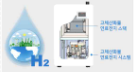
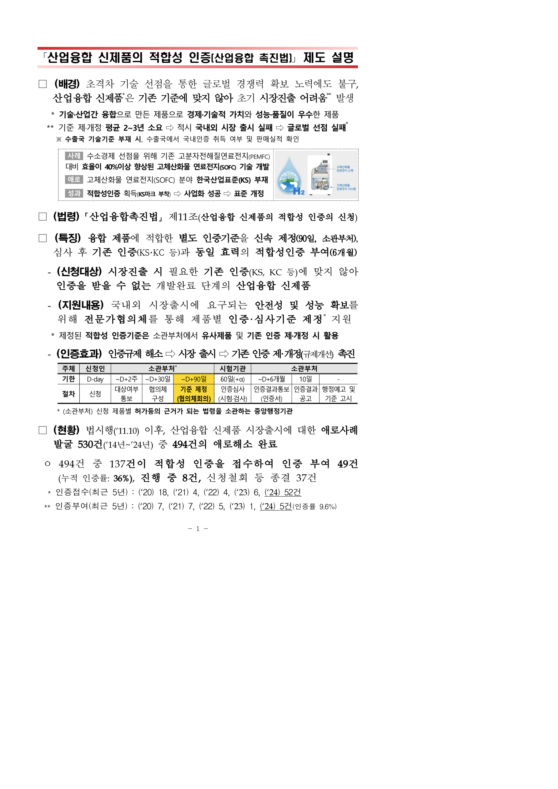

# 「산업융합 신제품의 적합성 인증(산업융합 촉진법)」 제도 설명

> 제도 설명 붙임의 원문 대조 교정본입니다. 이 파일은 인증기준 본문이 아닙니다.

## 배경

초격차 기술 선점을 통한 글로벌 경쟁력 확보 노력에도 불구, 산업융합 신제품*은 기존 기준에 맞지 않아 초기 시장진출 어려움** 발생

* 기술·산업간 융합으로 만든 제품으로 경제·기술적 가치와 성능·품질이 우수한 제품

** 기준 제·개정 평균 2~3년 소요 ⇒ 적시 국내외 시장 출시 실패 ⇒ 글로벌 선점 실패*

※ 수출국 기술기준 부재 시, 수출국에서 국내인증 취득 여부 및 판매실적 확인

### 사례

수소경제 선점을 위해 기존 고분자전해질연료전지(PEMFC) 대비 효율이 40%이상 향상된 고체산화물 연료전지(SOFC) 기술 개발

- 애로: 고체산화물 연료전지(SOFC) 분야 한국산업표준(KS) 부재
- 성과: 적합성인증 획득(KS마크 부착) ⇒ 사업화 성공 ⇒ 표준 개정

## 법령

「산업융합촉진법」 제11조(산업융합 신제품의 적합성 인증의 신청)

## 특징

융합 제품에 적합한 별도 인증기준을 신속 제정(90일, 소관부처), 심사 후 기존 인증(KS·KC 등)과 동일 효력의 적합성인증 부여(6개월)

- (신청대상) 시장진출 시 필요한 기존 인증(KS, KC 등)에 맞지 않아 인증을 받을 수 없는 개발완료 단계의 산업융합 신제품
- (지원내용) 국내외 시장출시에 요구되는 안전성 및 성능 확보를 위해 전문가협의체를 통해 제품별 인증·심사기준 제정* 지원

* 제정된 적합성 인증기준은 소관부처에서 유사제품 및 기존 인증 제·개정 시 활용

- (인증효과) 인증규제 해소 ⇒ 시장 출시 ⇒ 기존 인증 제·개정(규제개선) 촉진

| 주체 | 신청인 | 소관부처* | 소관부처* | 소관부처* | 시험기관 | 소관부처 | 소관부처 | 소관부처 |
| --- | --- | --- | --- | --- | --- | --- | --- | --- |
| 기한 | D-day | ~D+2주 | ~D+30일 | ~D+90일 | 60일(+α) | ~D+6개월 | 10일 | - |
| 절차 | 신청 | 대상여부 통보 | 협의체 구성 | 기준 제정 (협의체회의) | 인증심사 (시험·검사) | 인증결과통보 (인증서) | 인증결과 공고 | 행정예고 및 기준 고시 |

* (소관부처) 신청 제품별 허가등의 근거가 되는 법령을 소관하는 중앙행정기관

## 현황

법시행(’11.10) 이후, 산업융합 신제품 시장출시에 대한 애로사례 발굴 530건(’14년~’24년) 중 494건의 애로해소 완료

- 494건 중 137건이 적합성 인증을 접수하여 인증 부여 49건(누적 인증률: 36%), 진행 중 8건, 신청철회 등 종결 37건

* 인증접수(최근 5년): (’20) 18, (’21) 4, (’22) 4, (’23) 6, (’24) 52건

** 인증부여(최근 5년): (’20) 7, (’21) 7, (’22) 5, (’23) 1, (’24) 5건(인증률 9.6%)

[공식 원본 PDF](https://law.go.kr/flDownload.do?flSeq=149981475)

원본 SHA-256: `00c980b9022ebfdc7deef95457113005bd9ebf6b91e31a2f613c5ab0354ebbce`

