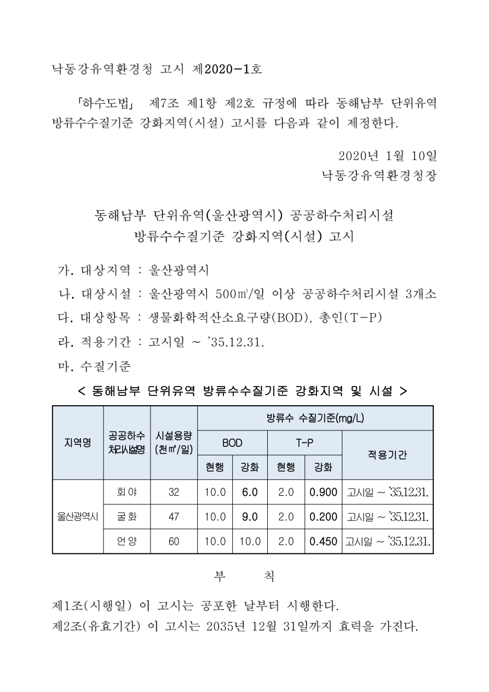

# 낙동강유역환경청 고시 제2020-1호

「하수도법」 제7조 제1항 제2호 규정에 따라 동해남부 단위유역 방류수수질기준 강화지역(시설) 고시를 다음과 같이 제정한다.

2020년 1월 10일

낙동강유역환경청장

## 동해남부 단위유역(울산광역시) 공공하수처리시설 방류수수질기준 강화지역(시설) 고시

가. 대상지역 : 울산광역시

나. 대상시설 : 울산광역시 500㎥/일 이상 공공하수처리시설 3개소

다. 대상항목 : 생물화학적산소요구량(BOD), 총인(T-P)

라. 적용기간 : 고시일 ∼ ’35.12.31.

마. 수질기준

### 동해남부 단위유역 방류수수질기준 강화지역 및 시설

| 지역명 | 공공하수 처리시설명 | 시설용량 (천㎥/일) | BOD 현행 (mg/L) | BOD 강화 (mg/L) | T-P 현행 (mg/L) | T-P 강화 (mg/L) | 적용기간 |
| --- | --- | --- | --- | --- | --- | --- | --- |
| 울산광역시 | 회야 | 32 | 10.0 | 6.0 | 2.0 | 0.900 | 고시일 ∼ ’35.12.31. |
| 울산광역시 | 굴화 | 47 | 10.0 | 9.0 | 2.0 | 0.200 | 고시일 ∼ ’35.12.31. |
| 울산광역시 | 언양 | 60 | 10.0 | 10.0 | 2.0 | 0.450 | 고시일 ∼ ’35.12.31. |

## 부칙

제1조(시행일) 이 고시는 공포한 날부터 시행한다.

제2조(유효기간) 이 고시는 2035년 12월 31일까지 효력을 가진다.

[공식 원본 PDF](https://law.go.kr/flDownload.do?flSeq=55420767)

원본 SHA-256: `0128ba19e3dcb83db2d3d2c9672b28966b22ffde5a500b5b87e29bef6793e958`

