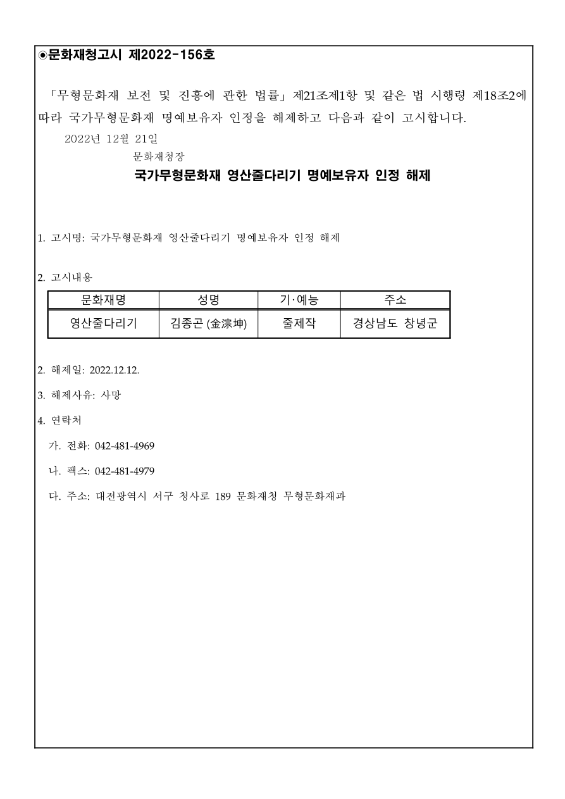

> 원문 대조 교정본. 원문에 있는 중복 번호와 “제18조2” 표기를 그대로 보존했습니다.

[공식 원본 PDF](https://law.go.kr/flDownload.do?flSeq=123024671)

원본 SHA-256: `0411a7517cc3bf2a746592facbf257b9b4b4510346c39a4fc86aa040a89ceeb7`

# 문화재청고시 제2022-156호

「무형문화재 보전 및 진흥에 관한 법률」 제21조제1항 및 같은 법 시행령 제18조2에 따라 국가무형문화재 명예보유자 인정을 해제하고 다음과 같이 고시합니다.

2022년 12월 21일

문화재청장

## 국가무형문화재 영산줄다리기 명예보유자 인정 해제

1. 고시명: 국가무형문화재 영산줄다리기 명예보유자 인정 해제

2. 고시내용

| 문화재명 | 성명 | 기·예능 | 주소 |
| --- | --- | --- | --- |
| 영산줄다리기 | 김종곤 (金淙坤) | 줄제작 | 경상남도 창녕군 |

2. 해제일: 2022.12.12.

3. 해제사유: 사망

4. 연락처

가. 전화: 042-481-4969

나. 팩스: 042-481-4979

다. 주소: 대전광역시 서구 청사로 189 문화재청 무형문화재과

## 원본 페이지 1

