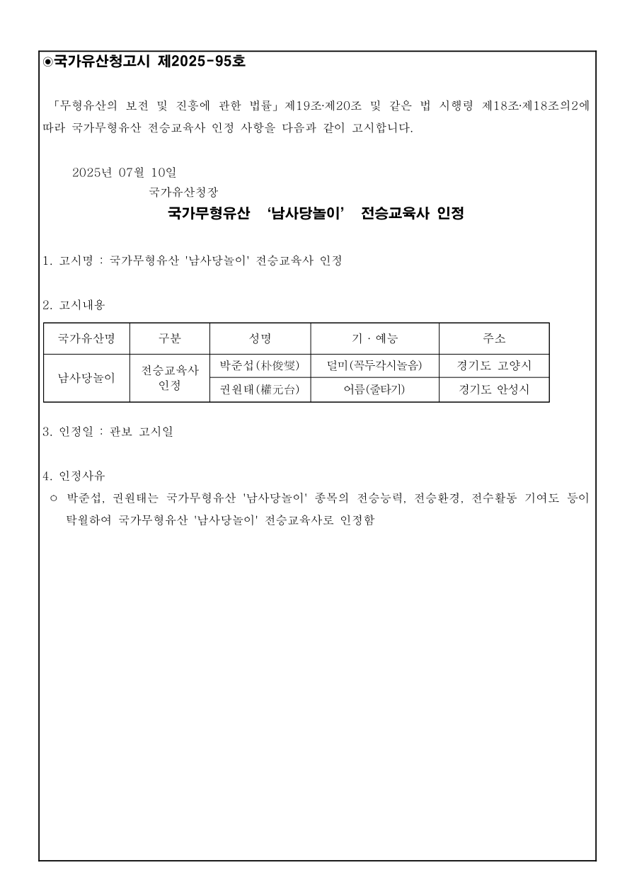

# 국가유산청고시 제2025-95호

「무형유산의 보전 및 진흥에 관한 법률」 제19조·제20조 및 같은 법 시행령 제18조·제18조의2에 따라 국가무형유산 전승교육사 인정 사항을 다음과 같이 고시합니다.

2025년 07월 10일

국가유산청장

## 국가무형유산 ‘남사당놀이’ 전승교육사 인정

1. 고시명 : 국가무형유산 '남사당놀이' 전승교육사 인정

2. 고시내용

| 국가유산명 | 구분 | 성명 | 기·예능 | 주소 |
| --- | --- | --- | --- | --- |
| 남사당놀이 | 전승교육사 인정 | 박준섭(朴俊燮) | 덜미(꼭두각시놀음) | 경기도 고양시 |
| 남사당놀이 | 전승교육사 인정 | 권원태(權元台) | 어름(줄타기) | 경기도 안성시 |

3. 인정일 : 관보 고시일

4. 인정사유

○ 박준섭, 권원태는 국가무형유산 '남사당놀이' 종목의 전승능력, 전승환경, 전수활동 기여도 등이 탁월하여 국가무형유산 '남사당놀이' 전승교육사로 인정함

[공식 원본 PDF](https://law.go.kr/flDownload.do?flSeq=154322731)

원본 SHA-256: `06253853545775d8b64dc6fb51cca9184fe79d4fcaa93ad9167bce7a23496354`

