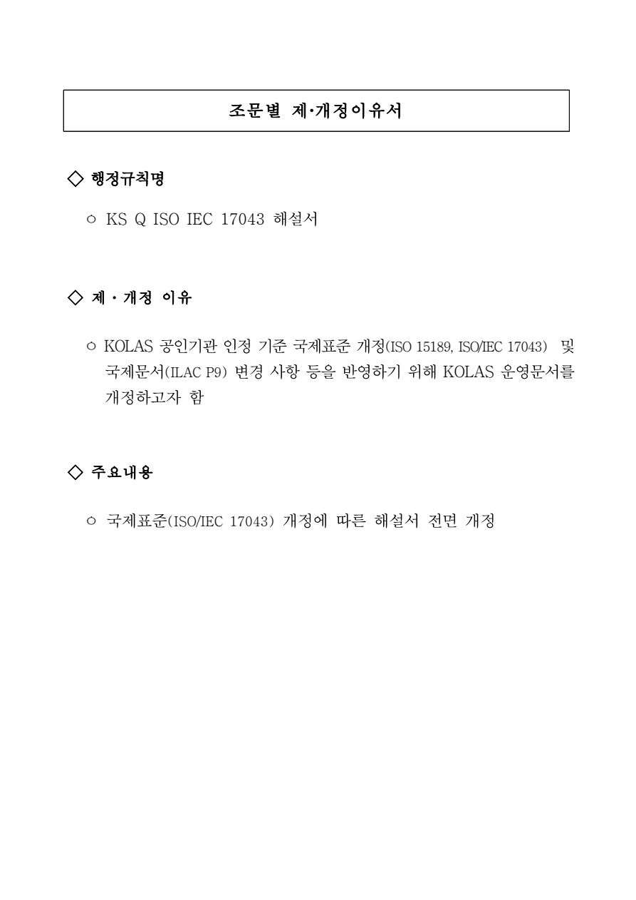

# 조문별 제·개정이유서

## 행정규칙명

○ KS Q ISO IEC 17043 해설서

## 제·개정 이유

○ KOLAS 공인기관 인정 기준 국제표준 개정(ISO 15189, ISO/IEC 17043) 및 국제문서(ILAC P9) 변경 사항 등을 반영하기 위해 KOLAS 운영문서를 개정하고자 함

## 주요내용

○ 국제표준(ISO/IEC 17043) 개정에 따른 해설서 전면 개정

[공식 원본 PDF](https://law.go.kr/flDownload.do?flSeq=148511019)

원본 SHA-256: `062b76b4e445ee253fe5bd41e7d43fe32ae6a2e61bb4f71ba8edff7d6bec7961`

