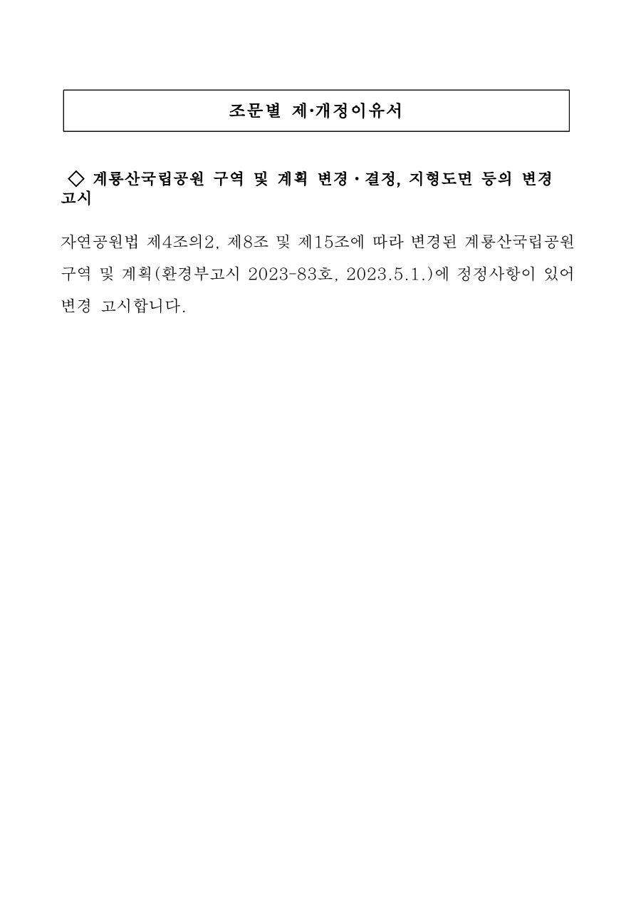

# 조문별 제·개정이유서

◇ 계룡산국립공원 구역 및 계획 변경·결정, 지형도면 등의 변경 고시

자연공원법 제4조의2, 제8조 및 제15조에 따라 변경된 계룡산국립공원 구역 및 계획(환경부고시 2023-83호, 2023.5.1.)에 정정사항이 있어 변경 고시합니다.

[공식 원본 PDF](https://law.go.kr/flDownload.do?flSeq=132810133)

원본 SHA-256: `07474b51db529b11922c583ade7c2b5205adf4b70fb48a733429350d7ec0572b`

