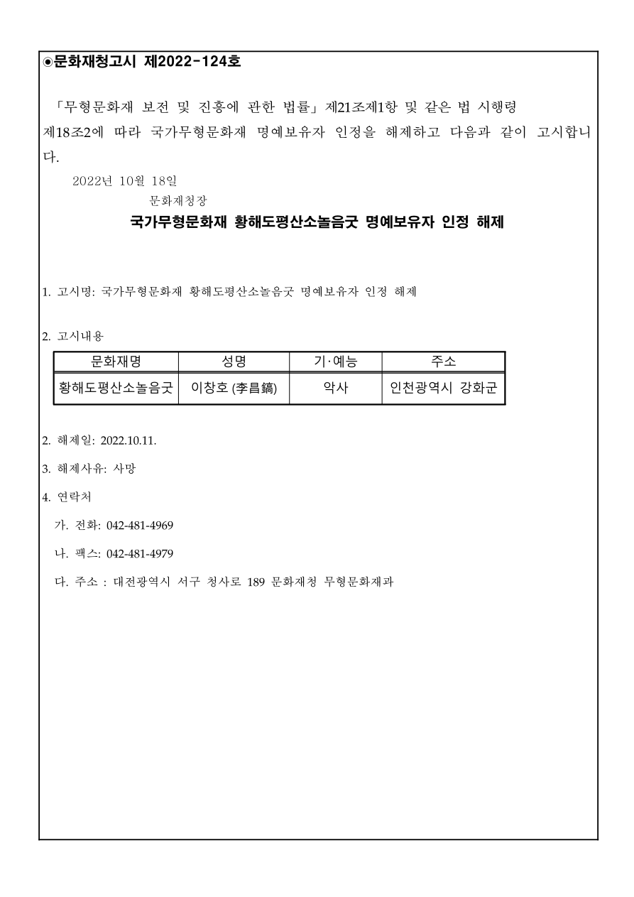

# 문화재청고시 제2022-124호

「무형문화재 보전 및 진흥에 관한 법률」 제21조제1항 및 같은 법 시행령 제18조2에 따라 국가무형문화재 명예보유자 인정을 해제하고 다음과 같이 고시합니다.

2022년 10월 18일

문화재청장

## 국가무형문화재 황해도평산소놀음굿 명예보유자 인정 해제

1. 고시명: 국가무형문화재 황해도평산소놀음굿 명예보유자 인정 해제

2. 고시내용

| 문화재명 | 성명 | 기·예능 | 주소 |
| --- | --- | --- | --- |
| 황해도평산소놀음굿 | 이창호 (李昌鎬) | 악사 | 인천광역시 강화군 |

2. 해제일: 2022.10.11.

3. 해제사유: 사망

4. 연락처

가. 전화: 042-481-4969

나. 팩스: 042-481-4979

다. 주소 : 대전광역시 서구 청사로 189 문화재청 무형문화재과

[공식 원본 PDF](https://law.go.kr/flDownload.do?flSeq=120430649)

원본 SHA-256: `07efb768ebf9fe1de08fdd74faae9a0d4d63b6fa8f9e6214f32c83eced315029`

