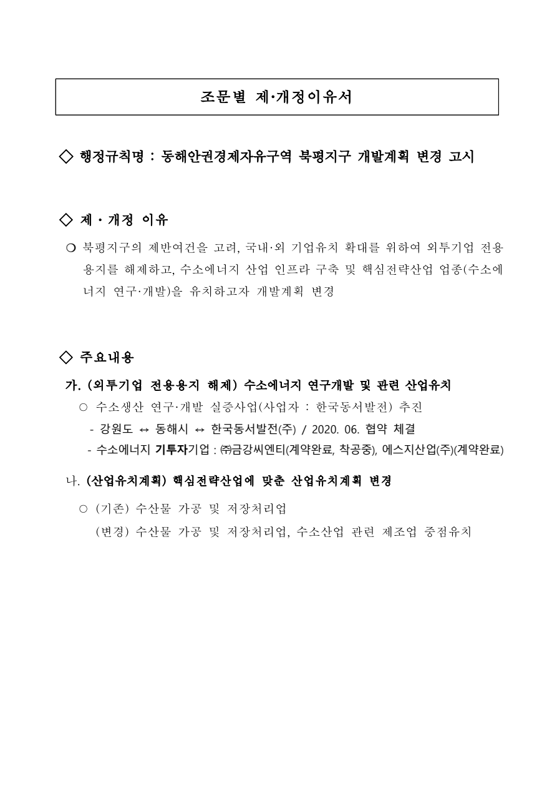

# 조문별 제·개정이유서

## 행정규칙명 : 동해안권경제자유구역 북평지구 개발계획 변경 고시

## 제·개정 이유

○ 북평지구의 제반여건을 고려, 국내·외 기업유치 확대를 위하여 외투기업 전용용지를 해제하고, 수소에너지 산업 인프라 구축 및 핵심전략산업 업종(수소에너지 연구·개발)을 유치하고자 개발계획 변경

## 주요내용

가. (외투기업 전용용지 해제) 수소에너지 연구개발 및 관련 산업유치

○ 수소생산 연구·개발 실증사업(사업자 : 한국동서발전) 추진

- 강원도 ↔ 동해시 ↔ 한국동서발전(주) / 2020. 06. 협약 체결
- 수소에너지 기투자기업 : ㈜금강씨엔티(계약완료, 착공중), 에스지산업(주)(계약완료)

나. (산업유치계획) 핵심전략산업에 맞춘 산업유치계획 변경

○ (기존) 수산물 가공 및 저장처리업

(변경) 수산물 가공 및 저장처리업, 수소산업 관련 제조업 중점유치

[공식 원본 PDF](https://law.go.kr/flDownload.do?flSeq=145704435)

원본 SHA-256: `0aa0558e05c6fce4d61f4e744553afdb282d1da9ab0211b677eec0c7a0abc1e5`

