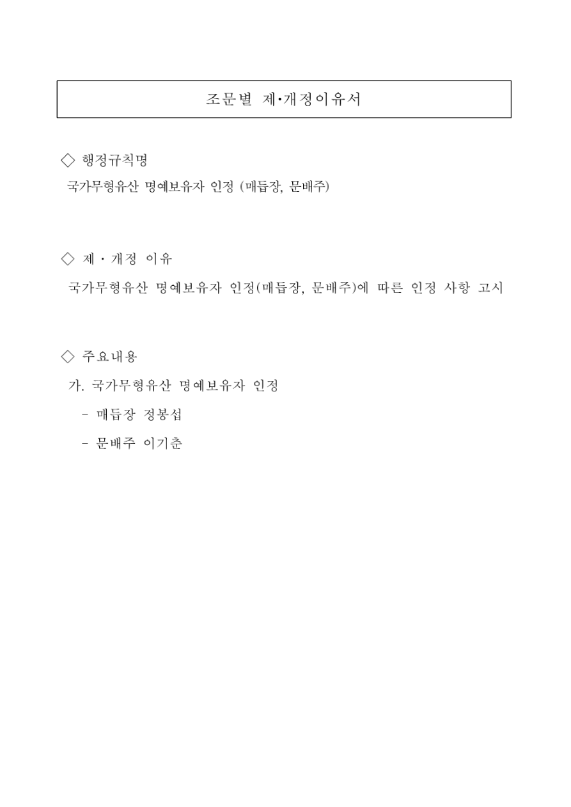

# 조문별 제·개정이유서

## 행정규칙명

국가무형유산 명예보유자 인정 (매듭장, 문배주)

## 제·개정 이유

국가무형유산 명예보유자 인정(매듭장, 문배주)에 따른 인정 사항 고시

## 주요내용

가. 국가무형유산 명예보유자 인정

- 매듭장 정봉섭
- 문배주 이기춘

---

변환 검증 메모: 제·개정이유서 붙임이며 인정 고시 전문은 아님.

[공식 원본 PDF](https://law.go.kr/flDownload.do?flSeq=148906211)

원본 SHA-256: `0afc8d73f221f2699e3c5bc652a3901e7648667628822fea4e322bcd3ee38bee`

