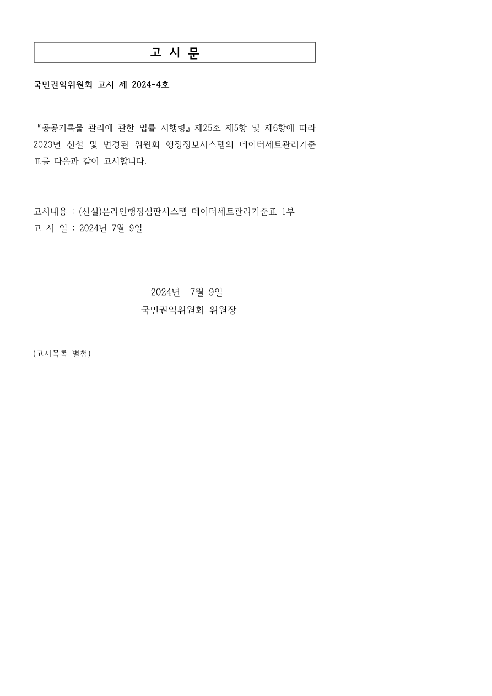

# 고시문

## 국민권익위원회 고시 제2024-4호

『공공기록물 관리에 관한 법률 시행령』 제25조 제5항 및 제6항에 따라 2023년 신설 및 변경된 위원회 행정정보시스템의 데이터세트관리기준표를 다음과 같이 고시합니다.

고시내용 : (신설)온라인행정심판시스템 데이터세트관리기준표 1부

고시일 : 2024년 7월 9일

2024년 7월 9일

국민권익위원회 위원장

(고시목록 별첨)

---

변환 검증 메모: 이 PDF는 고시문 1쪽입니다. 원문에 고시목록 별첨으로 표시되어 있으나 해당 PDF에는 별첨 데이터세트관리기준표가 포함되어 있지 않습니다.

[공식 원본 PDF](https://law.go.kr/flDownload.do?flSeq=142302989)

원본 SHA-256: `0cb88ceafe5a5e5506cbada7ba6be1c33a6099e85a9a0f19fc524395f1ceb203`

