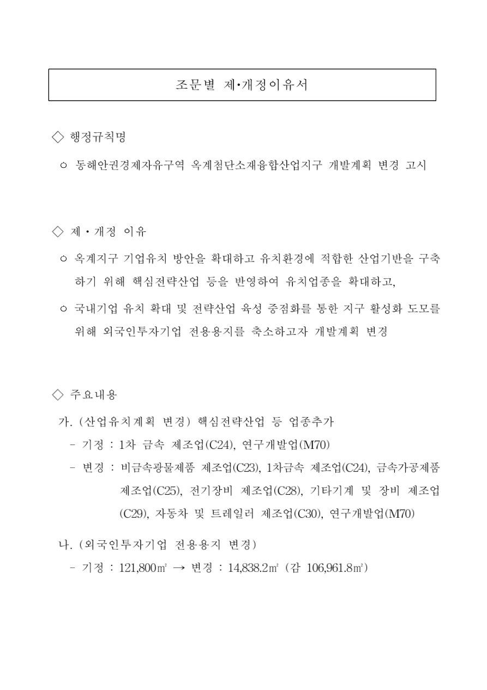

# 조문별 제·개정이유서

## 행정규칙명

○ 동해안권경제자유구역 옥계첨단소재융합산업지구 개발계획 변경 고시

## 제·개정 이유

○ 옥계지구 기업유치 방안을 확대하고 유치환경에 적합한 산업기반을 구축하기 위해 핵심전략산업 등을 반영하여 유치업종을 확대하고,

○ 국내기업 유치 확대 및 전략산업 육성 중점화를 통한 지구 활성화 도모를 위해 외국인투자기업 전용용지를 축소하고자 개발계획 변경

## 주요내용

가. (산업유치계획 변경) 핵심전략산업 등 업종추가

- 기정 : 1차 금속 제조업(C24), 연구개발업(M70)
- 변경 : 비금속광물제품 제조업(C23), 1차금속 제조업(C24), 금속가공제품 제조업(C25), 전기장비 제조업(C28), 기타기계 및 장비 제조업(C29), 자동차 및 트레일러 제조업(C30), 연구개발업(M70)

나. (외국인투자기업 전용용지 변경)

- 기정 : 121,800㎡ → 변경 : 14,838.2㎡ (감 106,961.8㎡)

[공식 원본 PDF](https://law.go.kr/flDownload.do?flSeq=135049907)

원본 SHA-256: `1151529dd5b5184222356d7a724a0da41e0dd38aa4994ce2177511494b068da1`

