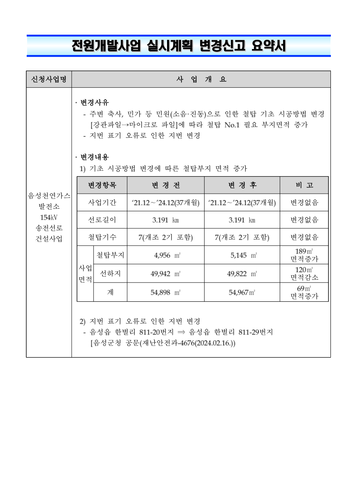

# 전원개발사업 실시계획 변경신고 요약서

## 신청사업명

음성천연가스 발전소 154kV 송전선로 건설사업

## 사업개요

### 변경사유

- 주변 축사, 민가 등 민원(소음·진동)으로 인한 철탑 기초 시공방법 변경 [강관파일→마이크로 파일]에 따라 철탑 No.1 필요 부지면적 증가
- 지번 표기 오류로 인한 지번 변경

### 변경내용

1) 기초 시공방법 변경에 따른 철탑부지 면적 증가

| 변경항목 | 변경 전 | 변경 후 | 비고 |
| --- | --- | --- | --- |
| 사업기간 | ’21.12∼’24.12(37개월) | ’21.12∼’24.12(37개월) | 변경없음 |
| 선로길이 | 3.191 km | 3.191 km | 변경없음 |
| 철탑기수 | 7(개조 2기 포함) | 7(개조 2기 포함) | 변경없음 |
| 사업면적 / 철탑부지 | 4,956 ㎡ | 5,145 ㎡ | 189㎡ 면적증가 |
| 사업면적 / 선하지 | 49,942 ㎡ | 49,822 ㎡ | 120㎡ 면적감소 |
| 사업면적 / 계 | 54,898 ㎡ | 54,967㎡ | 69㎡ 면적증가 |

2) 지번 표기 오류로 인한 지번 변경

- 음성읍 한벌리 811-20번지 ⇒ 음성읍 한벌리 811-29번지

[음성군청 공문(재난안전과-4676(2024.02.16.))

---

변환 검증 메모: 변경신고 요약서 붙임입니다. 원문 마지막 공문 표기의 닫는 대괄호 누락은 임의 보완하지 않았습니다.

[공식 원본 PDF](https://law.go.kr/flDownload.do?flSeq=140920183)

원본 SHA-256: `12ab0a96186ad4fe48ac89bf01462de7eb71d6c5f5edb196783b63a04a769119`

