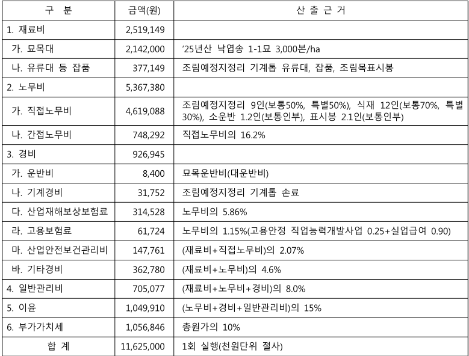

# 2026년도 조림비용 고시

> 검색·열람 편의를 위한 변환본입니다. 정확한 내용은 원문을 확인하세요.

[공식 원본 PDF](https://law.go.kr/flDownload.do?flSeq=160701265)

원본 SHA-256: `29808b7d9399b4a0423faf3762960c3854397e1467d52b97274d2044288b327b`

## 원문 PDF 1–1쪽

## ◉산림청고시 제2026-08호

「산림자원의 조성 및 관리에 관한 법률」제10조, 제79조제5항 내지 제6항, 같은 법 시행령 제73 조의 별표3 및 같은 법 시행규칙 제6조제4항에 따라 2026년도 조림비용을 다음과 같이 고시합니다. 2026년 01월 07일

산림청장

## 2026년도 조림비용 고시

## 1. 2026년도 조림비용 고시

「산림자원의 조성 및 관리에 관한 법률」제10조, 제79조제5항 내지 제6항, 같은 법 시행령 제73 조의 별표3 및 같은 법 시행규칙 제6조제4항에 따라 2026년도 조림비용을 다음과 같이 고시

| 구 분          |      금액(원) | 산 출 근 거                                                                         |
|--------------|------------|---------------------------------------------------------------------------------|
| 1. 재료비       |  2,519,149 |                                                                                 |
| 가. 묘목대       |  2,142,000 | '25년산 낙엽송 1-1묘 3,000본/ha                                                        |
| 나. 유류대 등 잡품  |    377,149 | 조림예정지정리 기계톱 유류대, 잡품, 조림목표시봉                                                     |
| 2. 노무비       |  5,367,380 |                                                                                 |
| 가. 직접노무비     |  4,619,088 | 조림예정지정리 9인(보통50%, 특별50%), 식재 12인(보통70%, 특별 30%), 소운반 1.2인(보통인부), 표시봉 2.1인(보통인부) |
| 나. 간접노무비     |    748,292 | 직접노무비의 16.2%                                                                    |
| 3. 경비        |    926,945 |                                                                                 |
| 가. 운반비       |      8,400 | 묘목운반비(대운반비)                                                                     |
| 나. 기계경비      |     31,752 | 조림예정지정리 기계톱 손료                                                                  |
| 다. 산업재해보상보험료 |    314,528 | 노무비의 5.86%                                                                      |
| 라. 고용보험료     |     61,724 | 노무비의 1.15%(고용안정 직업능력개발사업 0.25+실업급여 0.90)                                        |
| 마. 산업안전보건관리비 |    147,761 | (재료비+직접노무비)의 2.07%                                                              |
| 바. 기타경비      |    362,780 | (재료비+노무비)의 4.6%                                                                 |
| 4. 일반관리비     |    705,077 | (재료비+노무비+경비)의 8.0%                                                              |
| 5. 이윤        |  1,049,910 | (노무비+경비+일반관리비)의 15%                                                             |
| 6. 부가가치세     |  1,056,846 | 총원가의 10%                                                                        |
| 합 계          | 11,625,000 | 1회 실행(천원단위 절사)                                                                  |

## 부 칙

이 고시는 고시한 날부터 시행한다.

### 표 1-1: 구조 및 원본 이미지

<table><tbody><tr><th>구 분</th><th>금액(원)</th><th>산 출 근 거</th></tr><tr><td>1. 재료비</td><td>2,519,149</td><td></td></tr><tr><td>가. 묘목대</td><td>2,142,000</td><td>&#x27;25년산 낙엽송 1-1묘 3,000본/ha</td></tr><tr><td>나. 유류대 등 잡품</td><td>377,149</td><td>조림예정지정리 기계톱 유류대, 잡품, 조림목표시봉</td></tr><tr><td>2. 노무비</td><td>5,367,380</td><td></td></tr><tr><td>가. 직접노무비</td><td>4,619,088</td><td>조림예정지정리 9인(보통50%, 특별50%), 식재 12인(보통70%, 특별 30%), 소운반 1.2인(보통인부), 표시봉 2.1인(보통인부)</td></tr><tr><td>나. 간접노무비</td><td>748,292</td><td>직접노무비의 16.2%</td></tr><tr><td>3. 경비</td><td>926,945</td><td></td></tr><tr><td>가. 운반비</td><td>8,400</td><td>묘목운반비(대운반비)</td></tr><tr><td>나. 기계경비</td><td>31,752</td><td>조림예정지정리 기계톱 손료</td></tr><tr><td>다. 산업재해보상보험료</td><td>314,528</td><td>노무비의 5.86%</td></tr><tr><td>라. 고용보험료</td><td>61,724</td><td>노무비의 1.15%(고용안정 직업능력개발사업 0.25+실업급여 0.90)</td></tr><tr><td>마. 산업안전보건관리비</td><td>147,761</td><td>(재료비+직접노무비)의 2.07%</td></tr><tr><td>바. 기타경비</td><td>362,780</td><td>(재료비+노무비)의 4.6%</td></tr><tr><td>4. 일반관리비</td><td>705,077</td><td>(재료비+노무비+경비)의 8.0%</td></tr><tr><td>5. 이윤</td><td>1,049,910</td><td>(노무비+경비+일반관리비)의 15%</td></tr><tr><td>6. 부가가치세</td><td>1,056,846</td><td>총원가의 10%</td></tr><tr><td>합 계</td><td>11,625,000</td><td>1회 실행(천원단위 절사)</td></tr></tbody></table>

