# 기초과학연구원 건립 기본계획

[공식 원본 PDF](https://law.go.kr/flDownload.do?flSeq=21146552)

원본 SHA-256: `4b7ac089f4f3f98edff330033c7b9d75aab61ce290a13c12a299351c0c6ed77e`

## 검증·열람 안내

고시문 PDF 1쪽, 계획 표지 2쪽, 목차 3쪽, 계획 본문 4~12쪽, 별첨 조감도 13~16쪽으로 구분했습니다.

2014년 원본에 기록된 계획과 금액이며 현재의 시설 현황을 뜻하지 않습니다.

PDF 8·9·12쪽 도식의 선·화살표·일정 위치와 PDF 13~16쪽 조감도는 원본 이미지로 제공합니다. 도식의 텍스트 설명은 전체 도식 전사를 대신하지 않습니다.

PDF 7쪽 본원 비율 항목 합계는 100.2%이고 인쇄된 총계는 100.0%입니다. 원문 수치를 변경하지 않았습니다.

총사업비 표는 백만원, 연도별 투자계획 표는 억원 단위입니다. 병합 셀은 문구로 명시하고, 정확한 셀 배치는 원본 이미지에 보존했습니다.

## PDF 1쪽 — 고시문

미래창조과학부 고시 제2014 - 34 호

국제과학비즈니스벨트 조성 및 지원에 관한 특별법 제8조 및 건설기술관리법 시행령 제58조에 따라 「기초과학연구원(본원·캠퍼스·중이온가속기) 건립 기본계획」을 다음과 같이 고시합니다.

2014. 5. 14.
미래창조과학부장관

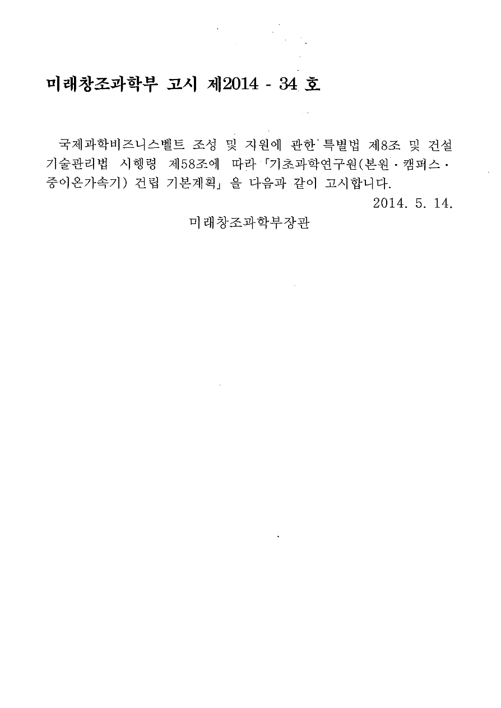

## PDF 2쪽 — 계획 표지

기초과학연구원 건립 기본계획
- 본원·캠퍼스·중이온가속기 -

2014. 5. 9.
미래창조과학부

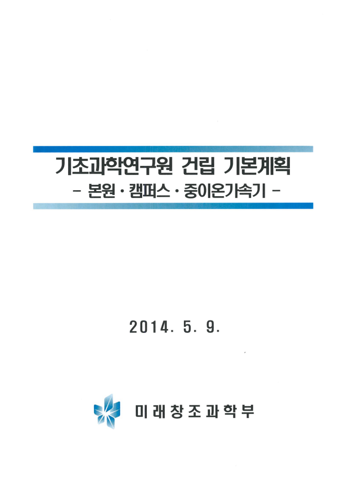

## PDF 3쪽 — 목차

| 항목 | 원문에 인쇄된 쪽수 |
| --- | --- |
| I. 건립 개요 | 1 |
| 1. 배경 및 필요성 | 1 |
| 2. 추진 경과 | 1 |
| II. 건립 목표 및 방향 | 2 |
| III. 건립 세부계획 | 3 |
| 1. 사업 개요 | 3 |
| 2. 시설 규모 | 4 |
| 3. 공구 분할 | 5 |
| 4. 발주 방식 | 5 |
| 5. 사업추진 체계 | 6 |
| 6. 사후 관리 | 7 |
| IV. 소요 예산 | 8 |
| 1. 총사업비 | 8 |
| 2. 연도별 투자 계획 | 8 |
| V. 건립 일정 | 9 |
| [별첨] 기초과학연구원(본원·캠퍼스·중이온가속기) 조감도 (예시) | 10 |

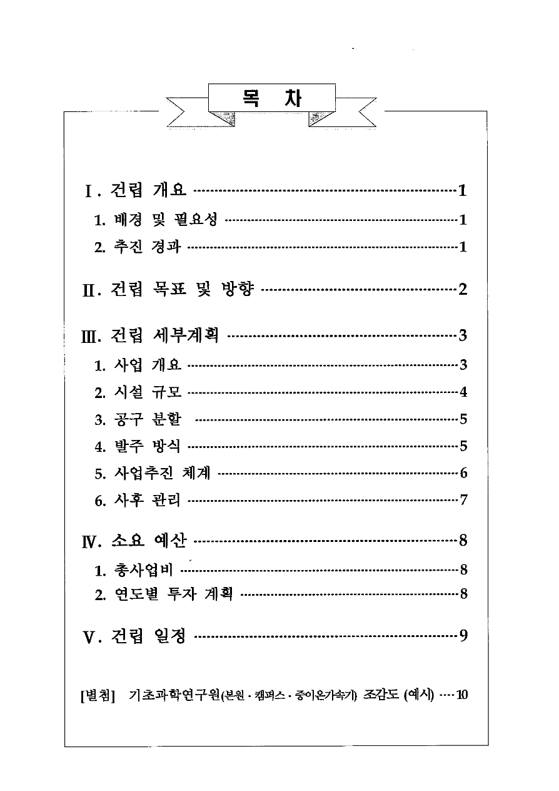

## PDF 4쪽 — 인쇄 1쪽

# I. 건립 개요

### 1. 배경 및 필요성

- ○ 과학벨트를 세계적 과학혁신클러스터로 발전시키기 위해 기초과학연구원/중이온가속기를 지역 랜드마크화 필요
  - ※ 막스플랑크연구소는 독일 드레스덴이 과학비즈니스도시로 성장하는데 주도적 역할
- ○ 과학벨트 기초연구거점으로서 기초과학연구원을 설립·운영('11.11) 중이나, 연구공간이 마련되지 않아 연구수행 및 인재유치에 제약
  - ※ 본원 및 중이온가속기(대전KT연구소 임차), 캠퍼스(특화대학내 임시공간 사용)
- ○ 우수인력 유치와 창의적 연구환경 조성을 위해 연구·교류·편의·휴식 공간이 통합된 ‘스마트 캠퍼스’형 공간조성이 필요

### 2. 추진 경과

- ○ '09. 01. : 「국제과학비즈니스벨트 종합계획」 심의·확정
- ○ '11. 05. : 「과학벨트 조성사업 추진계획」 심의·확정
- ○ '11. 11~12. : 「기초과학연구원」 설립 / 「중이온가속기사업단」 설치
- ○ '11. 12. : 「국제과학비즈니스벨트 기본계획」 심의·확정
  - * 기초과학연구원 (둔곡지구) / 중이온가속기(신동지구) 입지 확정
- ○ '13. 08. : 「국제과학비즈니스벨트 기본계획 변경」 심의·확정
  - * 기초과학연구원 건립 부지 이전(둔곡지구 → 도룡지구)
- ○ '13. 12. : 「국제과학비즈니스벨트 도룡거점지구 개발계획」 확정
- ○ '12.07~'14.1 : 기재부(KDI) 「과학벨트 조성사업 적정성 검토」 완료*
  - * 과학벨트 기본계획 대비 사업기간 연장('17 → '21), 총사업규모 확대(5조 1,700억원 → 5조 7,471억원(부지매입비 포함))

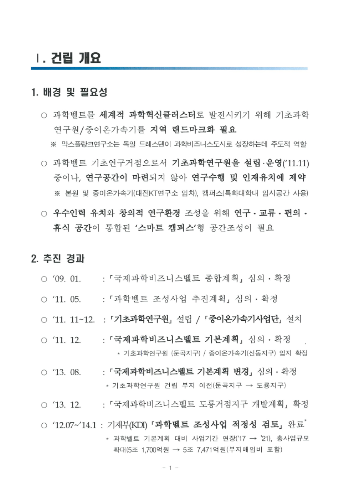

## PDF 5쪽 — 인쇄 2쪽

# II. 건립 목표 및 방향

도식의 위→아래 순서: 연구원 비전 → 건립 목표 → 건립 방향.

### 연구원 비전

기초과학분야 세계 10대 연구기관

### 건립 목표

기초과학연구원 본원, 중이온가속기, 캠퍼스를 기능적·지역적으로 연계 조성하여 ‘창의적 지식생태계’ 구축

### 건립 방향

| 구분 | 설명 | 지향점 |
| --- | --- | --- |
| Global | 과학벨트 랜드마크로서 선도적 디자인과 최첨단 연구시설·편의휴식 공간이 조화된 | 세계적 수준의 연구공간 |
| Creativity | 연구그룹/연구자간 자유로운 소통과 긴밀한 네트워킹이 가능한 | 창의적 연구공간 |
| Needs | 학문·기술 분야별 다양한 수요와 연구특성을 반영한 | 수요기반 공간구성 |
| Future | 충분한 공원·녹지와 환경 친화적 건축을 통한 | 미래지향적 건립 |
| Open | 출연연·벤처/중소기업·대학·연구원·지역사회 등에 열려 있는 | 개방형 연구원 건립 |

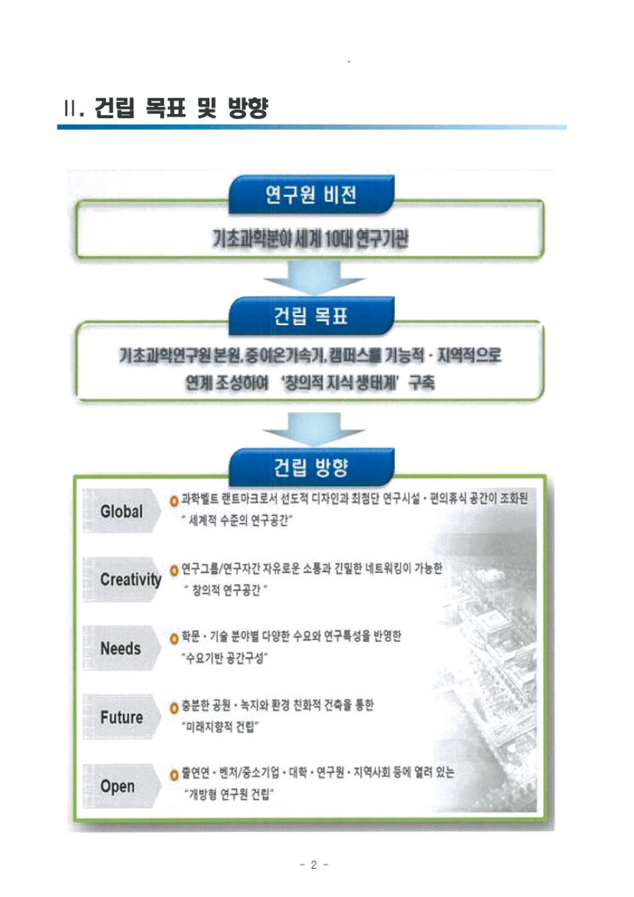

## PDF 6쪽 — 인쇄 3쪽

# III. 건립 세부계획

### 1. 사업 개요

- ○ 기간 : 2014 ~ 2021년 (8년간)
  - * 본원 : '17년 1차 완공(9개 연구동, 행정시설 등), '21년 2차 완공(추가 연구동, 행정시설)
  - * 캠퍼스 : 연구단 선정과 연계하여 사업기간 중 건립 추진
  - * 가속기 : '19년 1차 완공(저에너지 가속기 관련시설), '21년 2차 완공(고에너지 가속기 관련시설)
- ○ 부지 : 총 1,383,480㎡ (본원 : 도룡지구, 캠퍼스 : 5개 특성화대, 가속기 : 신동지구)
  - * KAIST연합, GIST, DIGIST, UNIST, POSTECH
  - ※ 본원·캠퍼스 부지는 대전시와 각 특화대학에서 제공 / 중이온가속기 부지는 정부매입
- ○ 건축규모 : 370,497㎡
- ○ 총사업비 : 1조 6,662억원 (부지매입비 3,600억 포함)
- ○ 시행자 : 미래창조과학부(본원, 캠퍼스, 가속기 일반시설) / 기초과학연구원(가속기 특수시설)
  - * 가속기 특수시설 : 가속기터널·활용실험시설·제어동 등 방사선인허가가 필요하고 가속기장치 구축사업과 긴밀한 연계가 필요한 시설

### 기초과학연구원 건립 계획 요약

| 구분 | 부지규모 | 건축면적* | 사업비** | 비고 |
| --- | --- | --- | --- | --- |
| 전체 | 1,383,480㎡ | 370,497㎡ | 16,662억 | |
| 기초과학연구원 본원 | 259,769㎡ | 112,740㎡ | 3,268억 | 과학벨트 도룡지구 (대전시 부지제공) |
| 기초과학연구원 캠퍼스 | 144,390㎡ | 127,500㎡ | 3,551억 | 5개 특성화대 본교 내 (각 대학 부지제공) |
| 중이온가속기 특수시설 | 979,321㎡*** (일반시설과 공유한 병합 셀) | 99,682㎡ | 4,641억 | 과학벨트 신동지구 (정부 부지매입) |
| 중이온가속기 일반시설 | 위 병합 셀과 동일 | 30,575㎡ | 5,202억 | 위 병합 셀과 동일 |

- * 녹색건축 인증('13.3월 시행)에 필요한 추가 소요비용 등을 고려하여 설계시 면적확정
- ** 중이온가속기/캠퍼스 연구단의 입주위치·규모 등에 따라 향후 관련 사업비간 일부조정 가능
- *** 중이온가속기 부지규모는 신동·둔곡지구 개발실시계획에 따라 변경 가능
- ※ 중이온가속기 장치구축 사업예산(총 4,602억원)은 건립기본계획에 미포함

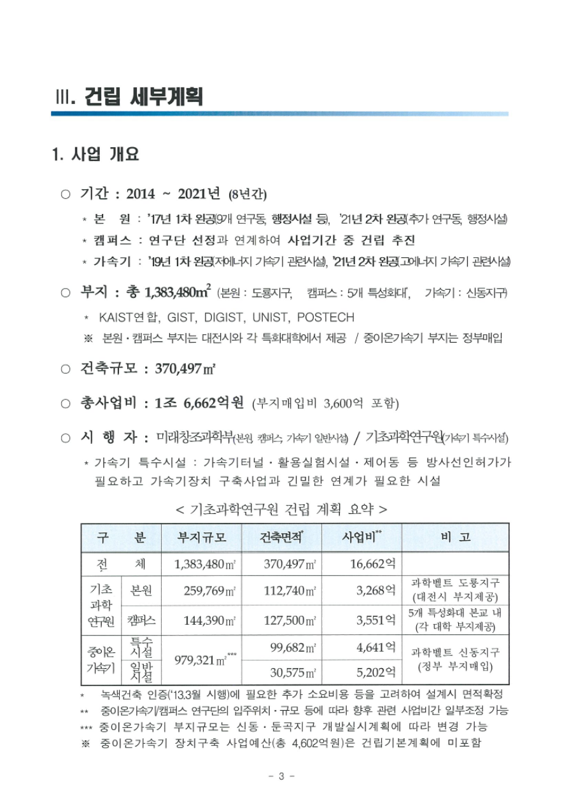

## PDF 7쪽 — 인쇄 4쪽

### 2. 시설규모

#### ○ 본원

| 시설구분 | 연면적(㎡) | 비율(%) | 프로그램 구성 | 비고 |
| --- | --- | --- | --- | --- |
| 연구시설 | 76,500 | 67.9 | 연구실, 실험실, 창고, 공용 | 미래부 (1차/2차) |
| 행정·교류시설 | 10,458 | 9.3 | 업무공간, 부속공간, 회의공간, 후생복지공간, 교육시설 | 미래부 (1차/2차) |
| 게스트하우스 | 9,426 | 8.4 | 해외유치과학자, 연구원 거주공간 등 | 미래부 (1차/2차) |
| 부대시설 | 5,020 | 4.5 | 다목적강당, 체육근린시설, 식당, 홍보 센터 | 미래부 (1차/2차) |
| 인프라시설 | 11,336 | 10.1 | 통합데이터센터, 통합에너지, 공급·관리시설, 오·폐기물 저장고 및 관리시설, 우수저장고 | 미래부 (1차) |
| 총계 | 112,740 | 100.0 | | |

* 파란 테두리: 국제과학비즈니스벨트 기반구축위원회 의견 반영.

#### ○ 캠퍼스(KAIST연합, GIST, DIGIST, UNIST, POSTECH)

| 시설구분 | 연면적(㎡) | 비율(%) | 프로그램 구성 | 비고 |
| --- | --- | --- | --- | --- |
| 연구시설 | 127,500 | 100 | 연구실, 실험실, 행정실, 장비실, 회의실, 후생복지, 유지관리 등 | 미래부 |
| 총계 | 127,500 | 100 | | |

#### ○ 중이온가속기

| 시설구분 | 연면적(㎡) | 비율(%) | 프로그램 구성 | 비고 |
| --- | --- | --- | --- | --- |
| 관리동 | 6,675 | 5.1 | 사무실, 회의실, 도서관, 식당, 휴게실, 관리사무실 | 미래부 (2차) |
| 이용자숙소 | 2,250 | 1.7 | 객실(1인실), 휴게실, 식당, 세탁실 등 | 미래부 (2차) |
| 가속기터널 | 33,182 | 25.5 | 가속기터널, Target Area, 빔라인, IntermediateTunnel, UtilityGallery 등 | 기초과학연 (1/2차) |
| 실험동 | 39,800 | 30.6 | 연구실, 실험실 등 | 기초과학연 (1/2차) |
| 지원시설동 | 48,350 | 37.1 | (특수시설) PowerPlant, Utility동, CryogenicPlant, 중앙제어동 / (일반시설) 수전설비, 오폐수시설, SupportBldg, 일반조립동 등 | 특수시설: 기초과학연 (1/2차) / 일반시설: 미래부 (1차/2차) |
| 총계 | 130,257 | 100 | | |

검증 메모: 본원 비율의 기재값 합은 100.2%이나, 원문 총계는 100.0%입니다. 원문 값을 유지합니다.

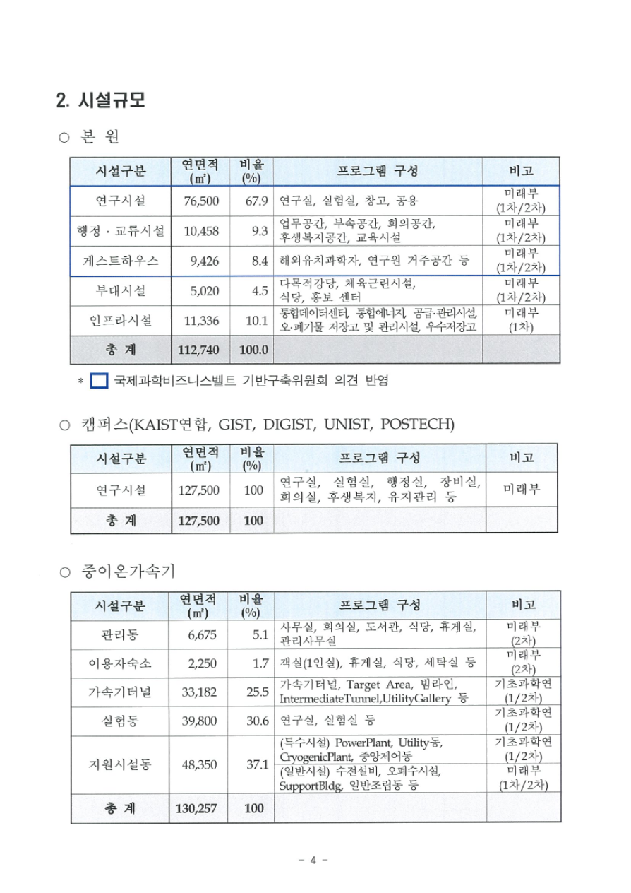

## PDF 8쪽 — 인쇄 5쪽

### 3. 공구 분할

○ 사업 규모, 건축 특징, 지리적 위치 등을 감안하여 총 8개 공구로 분리·건립

※ 본원(1개 공구), 중이온가속기(2개 공구 : 특수시설+일반시설), 캠퍼스(5개 공구 : KAIST연합, GIST, DIGIST, UNIST, POSTECH)

### 4. 발주 방식

○ 과학벨트의 상징성·특수성을 고려하고 발주청·연구원·연구자 등의 다양한 의견이 반영될 수 있도록 “설계·시공 분리” 방식으로 발주

- 설계자/시공자는 각 공구별 특성을 반영하여 평가·선정

○ 감리는 대규모 국책사업임을 고려 건설사업관리(CM) 적용

#### 설계·시공자 선정 방식

| 구분 | 설계자 | 시공자 | 비고 |
| --- | --- | --- | --- |
| 기초과학연구원 본원 | 설계공모 | 일반입찰 (제한방식) | 과학벨트 랜드마크로서 선도적 디자인을 갖춘 스마트건물로서 설계·시공 / 연구원 설계·시공경험이 있는 우수 업체 선정 |
| 기초과학연구원 캠퍼스 | 설계공모 또는 적격심사 (PQ+TP+입찰) | 일반입찰 | 5개 캠퍼스 유치대학의 의견을 반영하여 설계·시공 |
| 중이온가속기 특수시설 | 적격심사 (PQ+TP+입찰) | 일반입찰 (제한방식) | 가속장치 구축과 연계하여 탄력적 설계·시공 / 원자력, 방사선 시설 등 특수시설 시공능력 보유업체 선정 |
| 중이온가속기 일반시설 | 설계공모 | 일반입찰 (제한방식) | 과학벨트 신동·둔곡지구 랜드마크로서 첨단대형연구시설단지로 조성 / 연구시설단지 조성경험이 있는 우수 업체 선정 |

참고 도식 ‘공사 발주방식 비교’는 원본 이미지로 보존합니다. 구분: 일괄입찰(턴키), 기본설계 기술제안입찰, 실시설계 기술제안입찰, 기타공사(일반입찰). 공사 단계: 기본설계 → 실시설계 → 시공. 화살표 구간과 설계자/시공자 역할은 원본을 확인하세요.

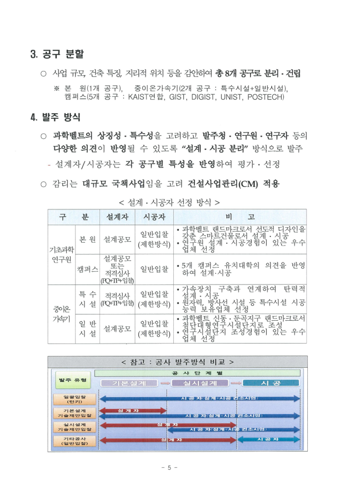

## PDF 9쪽 — 인쇄 6쪽

### 5. 사업추진 체계

추진체계도는 원본 이미지로 보존합니다. 미래창조과학부의 정부직접 시행과 출연사업 시행의 분기, 보고·심의선 및 기관별 역할을 임의로 합치지 않습니다.

○ (본원/캠퍼스) 미래부는 발주청으로서 기초과학연구원 본원·캠퍼스 건립을 총괄·시행·관리·감독

- 엑스포과학공원 철거공사는 대전마케팅공사*가 총괄 시행하되, 기초과학연구원 부지의 철거 비용은 미래부가 지원
  - * 엑스포과학공원/과학벨트 도룡거점지구 개발 시행자 (엑스포과학공원 부지/건물 소유자)

○ (중이온가속기) 단지조성·일반시설 건립은 미래부가 직접시행, 특수시설은 기초과학연구원(중이온가속기사업단)에 출연사업으로 추진

- 가속기 부지는 한국토지주택공사*가 개발·조성하되, 협약에 따라 미래부가 부지 매입
  - * 과학벨트 신동·둔곡거점지구 개발 시행자
- 특수시설 건립은 중이온가속기 구축사업과 연계를 위해 “중이온가속기구축사업 추진위원회” 심의를 거쳐 추진

○ (자문기구/협의체) 건축자문위, 조달청 맞춤형서비스, 건립사업 관계기관 협의회 등의 자문·검토를 거쳐 투명한 사업 추진

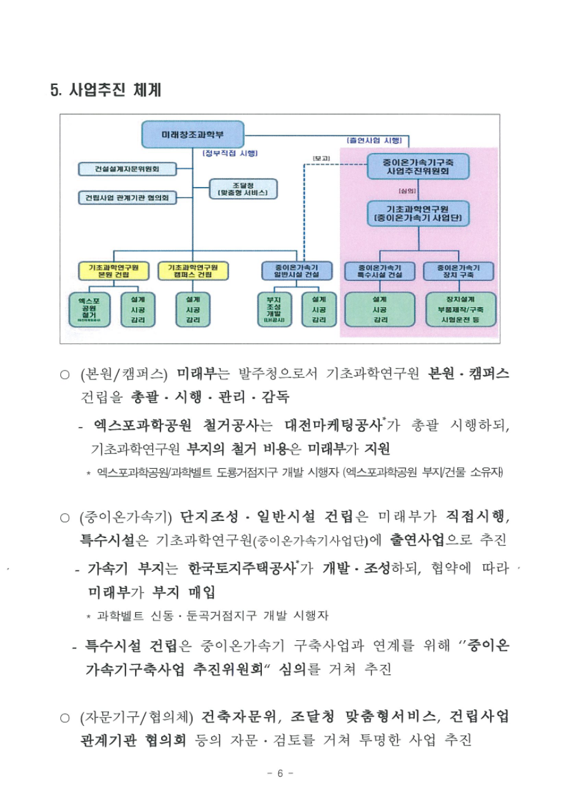

## PDF 10쪽 — 인쇄 7쪽

### ○ 주요기구별 세부역할

| 구분 | 세부 역할 |
| --- | --- |
| 미래창조과학부 | 건립기본계획 수립, 연도별 시행계획 수립 / 본원·캠퍼스, 중이온가속기(일반시설)의 설계·시공·감리 등 사업관리 총괄 / 중이온가속기(특수시설) 사업예산 출연, 주관연구기관 관리·감독 / 중이온가속기구축추진위, 건축자문위 등 구성·운영 |
| 기초과학연구원 (중이온가속기사업단) | 중이온가속기 특수시설(가속기 장치구축 포함)의 설계·시공·감리 등 사업관리 총괄 / 중이온가속기 특수시설 원자력·방사능 인허가에 관한 사항 / 중이온가속기 일반시설 건립 관련 미래부 자문 |
| 중이온가속기구축 사업추진위원회 | 중이온가속기 특수시설 건립에 관한 사항 심의 |
| 건축자문위원회 | 기초과학연구원(본원/중이온가속기/캠퍼스) 설계·시공 등에 관한사항 자문 |
| 건립사업 관계기관 협의회 | 기초과학연구원(본원/중이온가속기/캠퍼스) 시설물 사용·사후 관리기관 등과 건립에 관한 주요사항 검토 및 협의. * 미래부, 조달청, IBS, 5개 특성화대 관계자 등으로 구성 |
| 조달청 | 맞춤형서비스 약정에 따른 업무 수행 및 지원 |

### 6. 사후 관리

○ (부지) 중이온가속기 부지는 국유재산법에 따라 국유재산으로 관리하되, 과학벨트법(제23조)에 따라 기초과학연구원에 무상 대부

○ (시설물) 본원·캠퍼스·중이온가속기 일반시설 등은 준공 이후 과학벨트법(제23조)에 따라 기초과학연구원에 무상양여 및 소유관리

※ 중이온가속기 특수시설(출연사업 추진)은 기초과학연구원에서 준공 및 소유관리

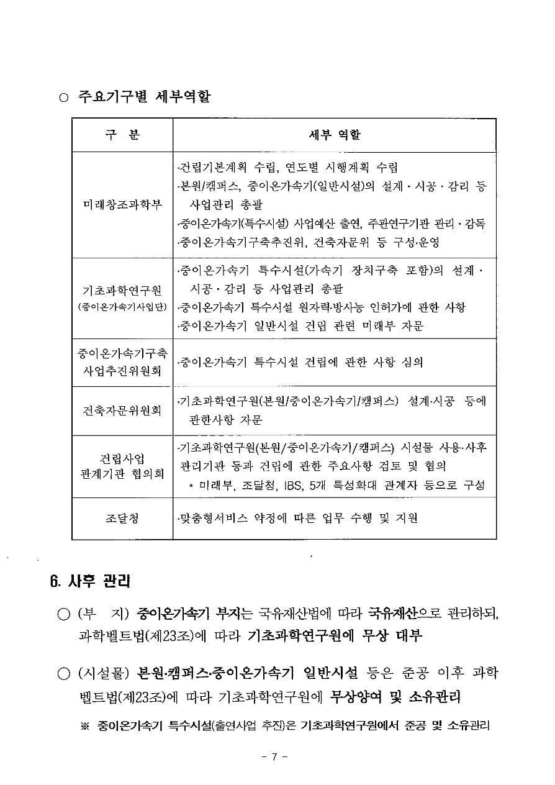

## PDF 11쪽 — 인쇄 8쪽

# IV. 소요 예산

### 1. 총사업비

단위: 백만원

| 구분 | 합계 | 본원 | 캠퍼스 | 중이온가속기 일반시설 | 중이온가속기 특수시설 | 중이온가속기 계 |
| --- | --- | --- | --- | --- | --- | --- |
| A. 공사비 | 1,196,423 | 299,175 | 322,376 | 147,336 | 427,536 | 574,872 |
| B. 부대비 | 109,739 | 27,588 | 32,683 | 12,861 | 36,607 | 49,468 |
| C. 소계(A+B) | 1,306,162 | 326,763 | 355,059 | 160,197 | 464,143 | 624,340 |
| D. 용지보상비 | 360,000 | - | - | 360,000 | - | 360,000 |
| E. 총사업비(C+D) | 1,666,162 | 326,763 | 355,059 | 520,197 | 464,143 | 984,340 |

※ 빨간 테두리: 미래부 직접 시행 / 파란 테두리: 기초과학연구원(중이온가속기사업단) 출연.

### 2. 연도별 투자 계획

단위: 억원

| 구분 | '14년 | '15년 | '16년 | '17년 | '18년 | '19~'21년 | 계 |
| --- | --- | --- | --- | --- | --- | --- | --- |
| 총계 | 1,387 | 1,856 | 2,415 | 4,492 | 1,529 | 4,983 | 16,662 |
| 기초과학연구원 (본원/캠퍼스) | 265 | 844 | 631 | 445 | 240 | 4,394 | 6,819 |
| 중이온가속기 (용지보상비 포함) | 1,122 | 1,012 | 1,784 | 4,047 | 1,289 | 589 | 9,843 |

※ 연도별 투자계획은 기재부(KDI) 사업적정성검토 결과를 반영하였으며, 연도별 예산사정에 따라 변경 가능.

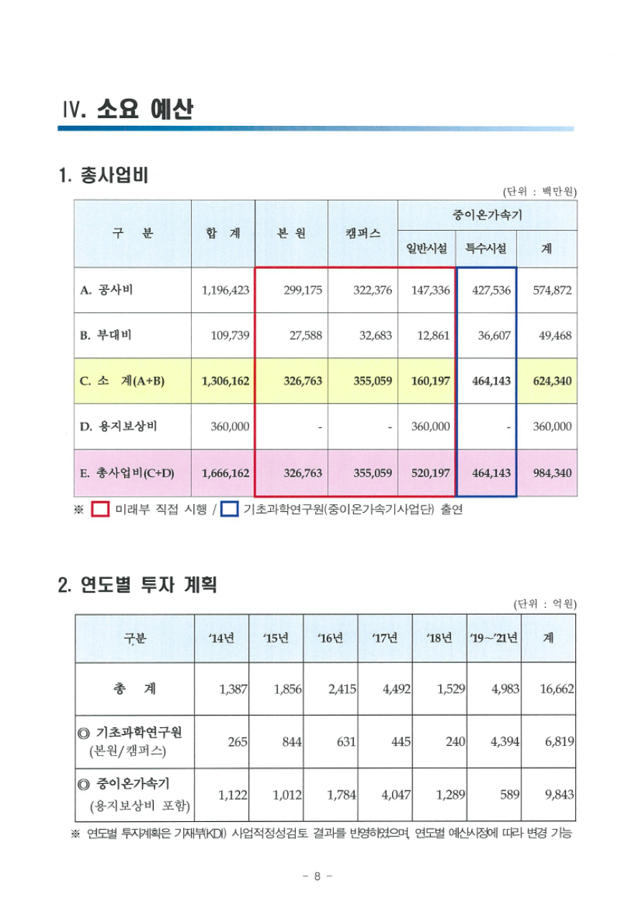

## PDF 12쪽 — 인쇄 9쪽

# V. 건립 일정

일정 막대와 준공 표시는 아래 원본 이미지에서 확인하세요.

※ 캠퍼스 건립일정은 캠퍼스 연구단 선정 현황 및 캠퍼스 시설운영방안 등과 연계하여 검토·추진.

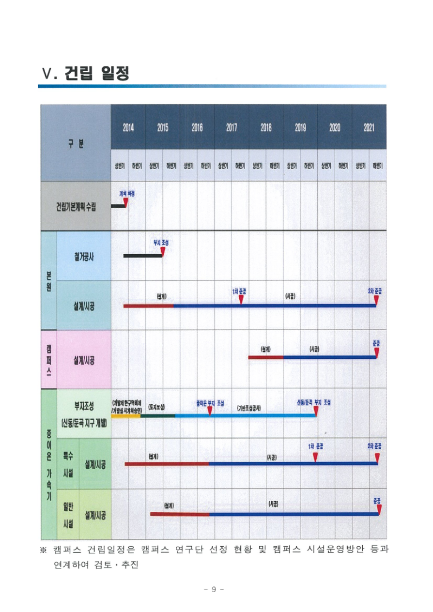

## PDF 13쪽 — 별첨 / 인쇄 10쪽

본원: 조감도 → 배치도 → 부분 투시도

※ 아래 조감도는 이해를 돕기 위한 단순참고용으로, 실제 건립은 설계 공모를 거쳐 추진예정

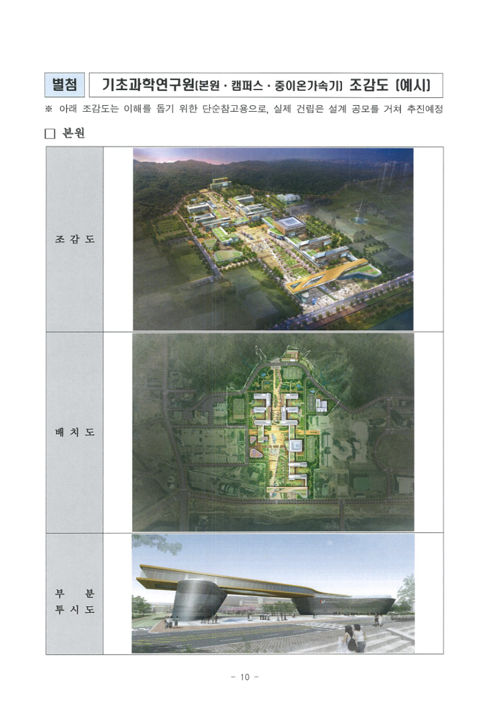

## PDF 14쪽 — 별첨 / 인쇄 11쪽

중이온가속기: 조감도 → 배치도

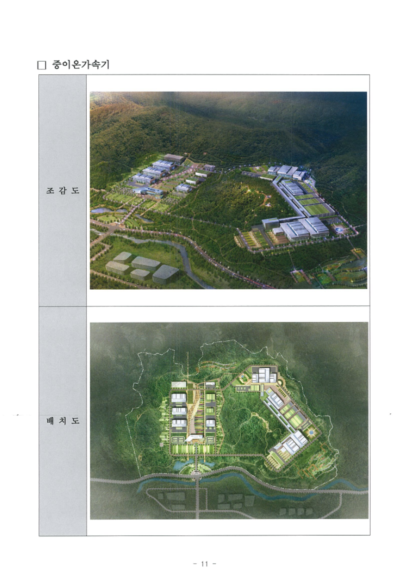

## PDF 15쪽 — 별첨 / 인쇄 12쪽

캠퍼스: KAIST 연합 캠퍼스 → POS-TECH 캠퍼스

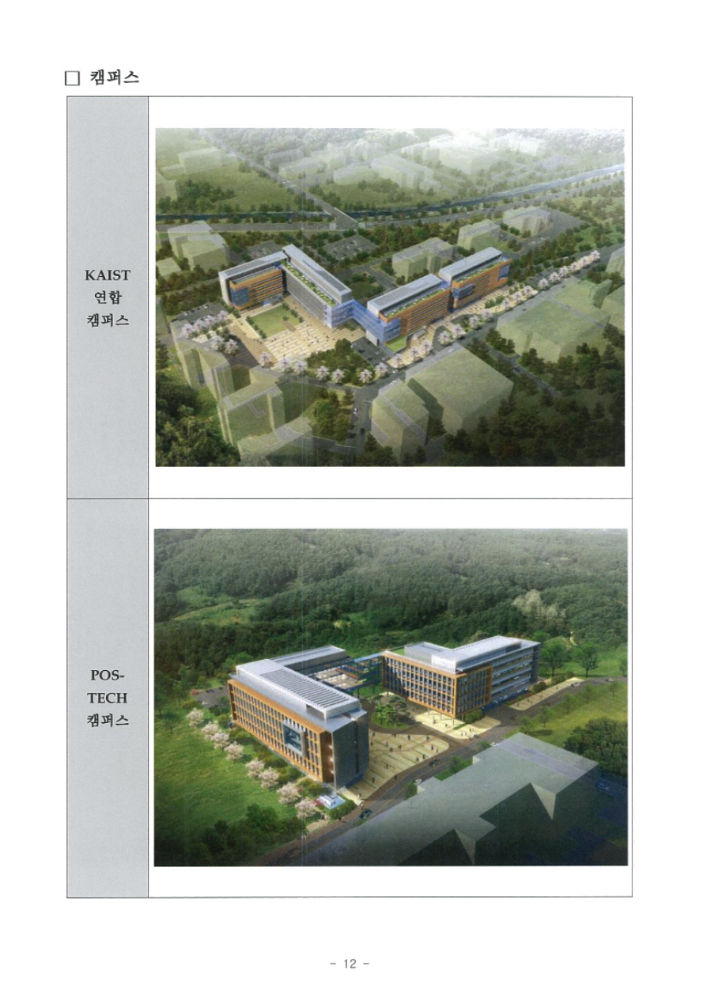

## PDF 16쪽 — 별첨 / 인쇄 13쪽

캠퍼스: DIGIST 캠퍼스 → UNIST 캠퍼스 → GIST 캠퍼스

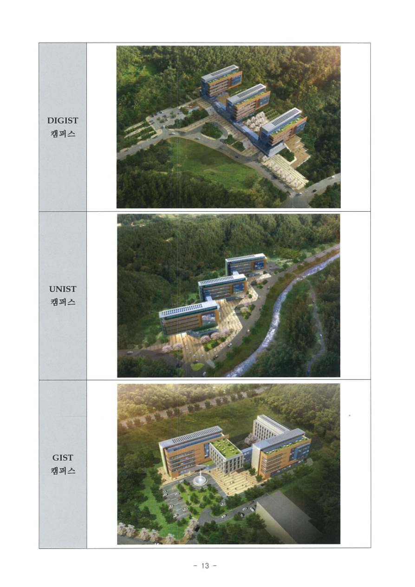
