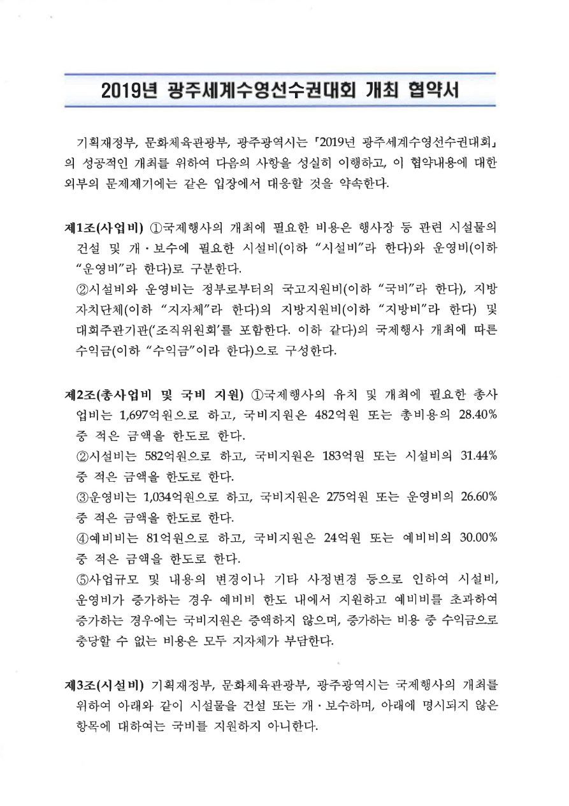
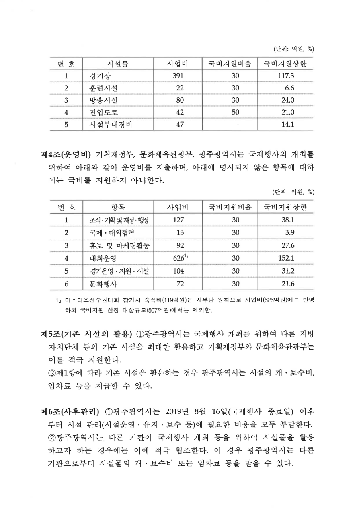
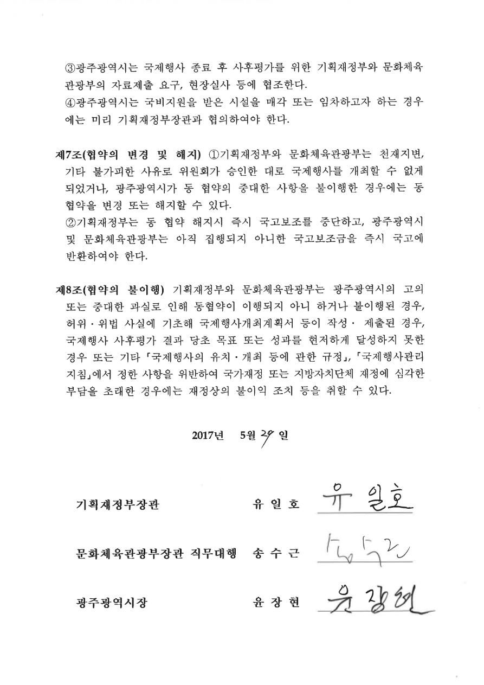

# 2019년 광주세계수영선수권대회 개최 협약서

[공식 원본 PDF](https://law.go.kr/flDownload.do?flSeq=31855224)

원본 SHA-256: `597297ccb3f85d5fdd3209bf9f98ce4ebd6b0cdcab28e82fd3da4df24ca7f366`

## 원문 1쪽

기획재정부, 문화체육관광부, 광주광역시는 「2019년 광주세계수영선수권대회」의 성공적인 개최를 위하여 다음의 사항을 성실히 이행하고, 이 협약내용에 대한 외부의 문제제기에는 같은 입장에서 대응할 것을 약속한다.

### 제1조(사업비)

① 국제행사의 개최에 필요한 비용은 행사장 등 관련 시설물의 건설 및 개·보수에 필요한 시설비(이하 “시설비”라 한다)와 운영비(이하 “운영비”라 한다)로 구분한다.

② 시설비와 운영비는 정부로부터의 국고지원비(이하 “국비”라 한다), 지방자치단체(이하 “지자체”라 한다)의 지방지원비(이하 “지방비”라 한다) 및 대회주관기관(‘조직위원회’를 포함한다. 이하 같다)의 국제행사 개최에 따른 수익금(이하 “수익금”이라 한다)으로 구성한다.

### 제2조(총사업비 및 국비 지원)

① 국제행사의 유치 및 개최에 필요한 총사업비는 1,697억원으로 하고, 국비지원은 482억원 또는 총비용의 28.40% 중 적은 금액을 한도로 한다.

② 시설비는 582억원으로 하고, 국비지원은 183억원 또는 시설비의 31.44% 중 적은 금액을 한도로 한다.

③ 운영비는 1,034억원으로 하고, 국비지원은 275억원 또는 운영비의 26.60% 중 적은 금액을 한도로 한다.

④ 예비비는 81억원으로 하고, 국비지원은 24억원 또는 예비비의 30.00% 중 적은 금액을 한도로 한다.

⑤ 사업규모 및 내용의 변경이나 기타 사정변경 등으로 인하여 시설비, 운영비가 증가하는 경우 예비비 한도 내에서 지원하고 예비비를 초과하여 증가하는 경우에는 국비지원은 증액하지 않으며, 증가하는 비용 중 수익금으로 충당할 수 없는 비용은 모두 지자체가 부담한다.

### 제3조(시설비)

기획재정부, 문화체육관광부, 광주광역시는 국제행사의 개최를 위하여 아래와 같이 시설물을 건설 또는 개·보수하며, 아래에 명시되지 않은 항목에 대하여는 국비를 지원하지 아니한다.

## 원문 2쪽

(제3조 표, 단위: 억원, %)

| 번호 | 시설물 | 사업비 | 국비지원비율 | 국비지원상한 |
| --- | --- | --- | --- | --- |
| 1 | 경기장 | 391 | 30 | 117.3 |
| 2 | 훈련시설 | 22 | 30 | 6.6 |
| 3 | 방송시설 | 80 | 30 | 24.0 |
| 4 | 진입도로 | 42 | 50 | 21.0 |
| 5 | 시설부대경비 | 47 | - | 14.1 |

### 제4조(운영비)

기획재정부, 문화체육관광부, 광주광역시는 국제행사의 개최를 위하여 아래와 같이 운영비를 지출하며, 아래에 명시되지 않은 항목에 대하여는 국비를 지원하지 아니한다.

(단위: 억원, %)

| 번호 | 항목 | 사업비 | 국비지원비율 | 국비지원상한 |
| --- | --- | --- | --- | --- |
| 1 | 조직·기획 및 재정·행정 | 127 | 30 | 38.1 |
| 2 | 국제·대외협력 | 13 | 30 | 3.9 |
| 3 | 홍보 및 마케팅활동 | 92 | 30 | 27.6 |
| 4 | 대회운영 | 626[^1] | 30 | 152.1 |
| 5 | 경기운영·지원·시설 | 104 | 30 | 31.2 |
| 6 | 문화행사 | 72 | 30 | 21.6 |

[^1]: 마스터즈선수권대회 참가자 숙식비(119억원)는 자부담 원칙으로 사업비(626억원)에는 반영하되 국비지원 산정 대상규모(507억원)에서는 제외함.

### 제5조(기존 시설의 활용)

① 광주광역시는 국제행사 개최를 위하여 다른 지방자치단체 등의 기존 시설을 최대한 활용하고 기획재정부와 문화체육관광부는 이를 적극 지원한다.

② 제1항에 따라 기존 시설을 활용하는 경우 광주광역시는 시설의 개·보수비, 임차료 등을 지급할 수 있다.

### 제6조(사후관리)

① 광주광역시는 2019년 8월 16일(국제행사 종료일) 이후부터 시설 관리(시설운영·유지·보수 등)에 필요한 비용을 모두 부담한다.

② 광주광역시는 다른 기관이 국제행사 개최 등을 위하여 시설물을 활용하고자 하는 경우에는 이에 적극 협조한다. 이 경우 광주광역시는 다른 기관으로부터 시설물의 개·보수비 또는 임차료 등을 받을 수 있다.

## 원문 3쪽

(제6조 계속)

③ 광주광역시는 국제행사 종료 후 사후평가를 위한 기획재정부와 문화체육관광부의 자료제출 요구, 현장실사 등에 협조한다.

④ 광주광역시는 국비지원을 받은 시설을 매각 또는 임차하고자 하는 경우에는 미리 기획재정부장관과 협의하여야 한다.

### 제7조(협약의 변경 및 해지)

① 기획재정부와 문화체육관광부는 천재지변, 기타 불가피한 사유로 위원회가 승인한 대로 국제행사를 개최할 수 없게 되었거나, 광주광역시가 동 협약의 중대한 사항을 불이행한 경우에는 동 협약을 변경 또는 해지할 수 있다.

② 기획재정부는 동 협약 해지시 즉시 국고보조를 중단하고, 광주광역시 및 문화체육관광부는 아직 집행되지 아니한 국고보조금을 즉시 국고에 반환하여야 한다.

### 제8조(협약의 불이행)

기획재정부와 문화체육관광부는 광주광역시의 고의 또는 중대한 과실로 인해 동협약이 이행되지 아니 하거나 불이행된 경우, 허위·위법 사실에 기초해 국제행사개최계획서 등이 작성·제출된 경우, 국제행사 사후평가 결과 당초 목표 또는 성과를 현저하게 달성하지 못한 경우 또는 기타 「국제행사의 유치·개최 등에 관한 규정」, 「국제행사관리지침」에서 정한 사항을 위반하여 국가재정 또는 지방자치단체 재정에 심각한 부담을 초래한 경우에는 재정상의 불이익 조치 등을 취할 수 있다.

2017년 5월 29일

기획재정부장관 유일호

문화체육관광부장관 직무대행 송수근

광주광역시장 윤장현

> 서명 필적은 아래 원본 3쪽 이미지에 보존했습니다.

## 변환 범위 및 원문 보존 사항

- 2017년 5월 29일 체결 협약서의 변환본이며 이후 변경 또는 현재 효력을 판정하지 않음.
- 제6조제4항의 임차 및 시설부대경비 국비지원비율의 -는 원문 그대로 보존.
- 서명 필적은 원본 페이지 이미지에 보존. 줄바꿈·띄어쓰기·가운뎃점은 열람용으로 정리.
