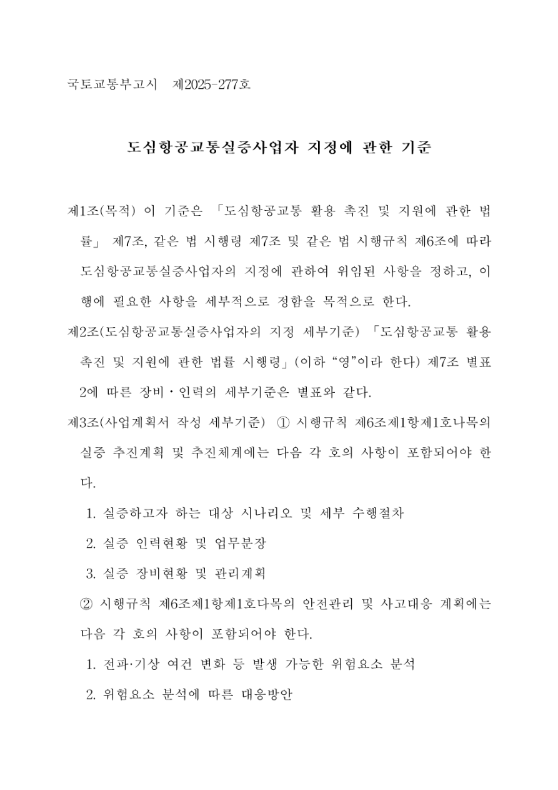
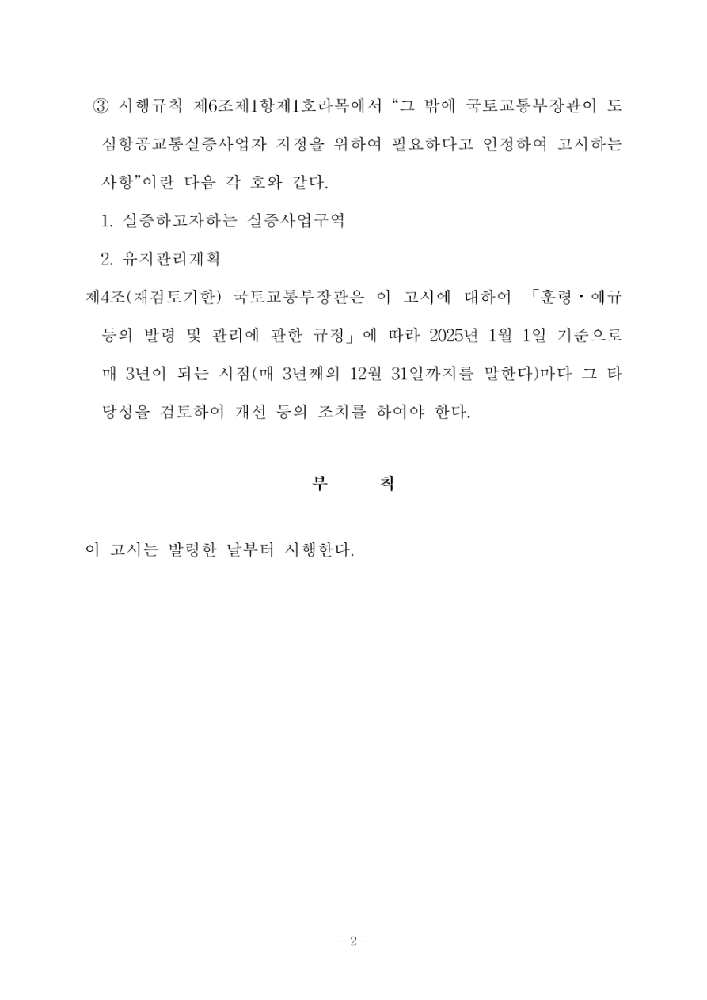
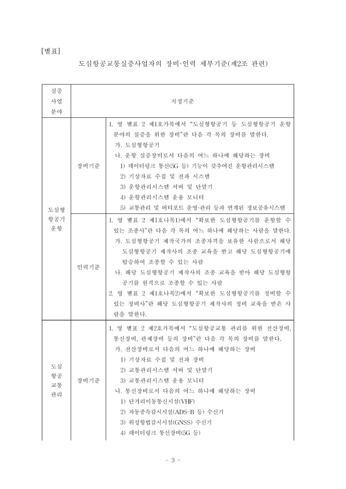
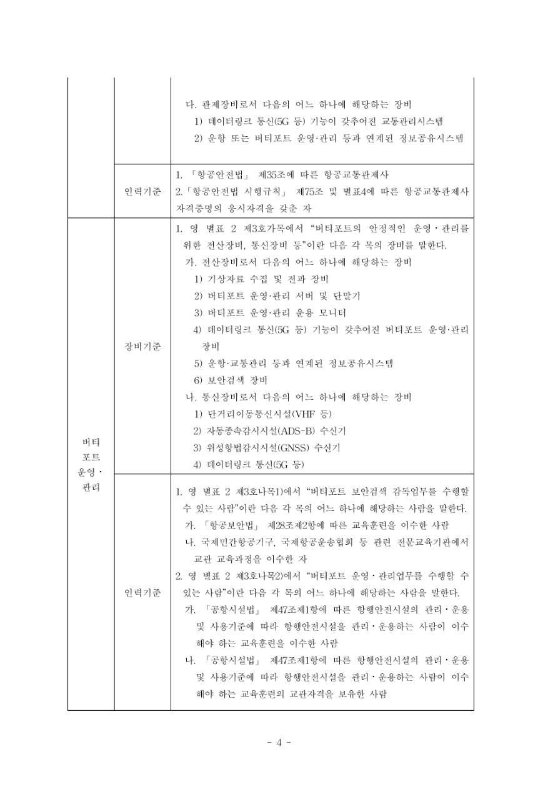
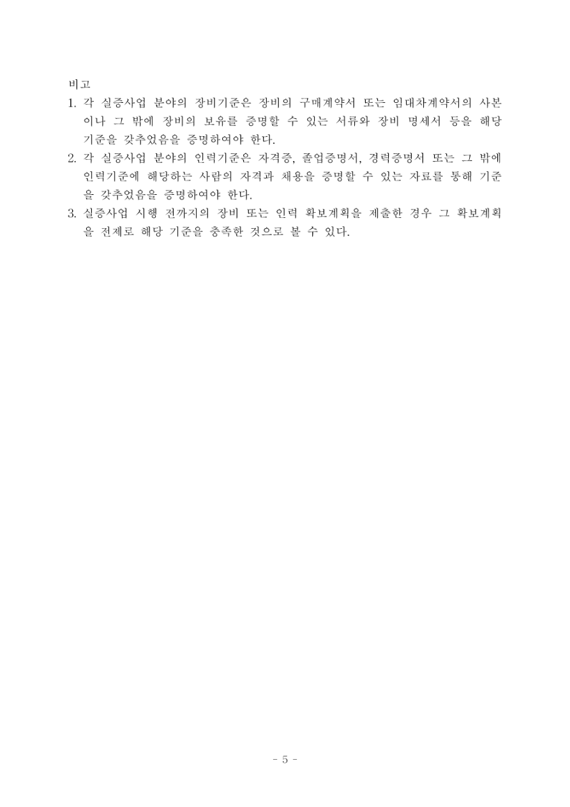

# 도심항공교통실증사업자 지정에 관한 기준

[공식 원본 PDF](https://law.go.kr/flDownload.do?flSeq=152419239)

원본 SHA-256: `9c5655b2ad176d7157698ad80fda37fd5c8cbbfdd82d36636f17ab8fb2aaaafc`

## 변환 범위

- 국토교통부고시 제2025-277호 PDF 5쪽 전체의 전사본이며 현행 여부를 판정하지 않습니다.
- 1~2쪽은 본문 및 부칙, 3~5쪽은 제2조 관련 별표입니다.
- 별표의 병합 셀은 분야·장비/인력기준을 반복 표시했고, 3~4쪽에 걸친 교통관리 장비기준은 계속행으로 연결했습니다.
- 원문 줄바꿈·띄어쓰기·가운뎃점은 열람용으로 정리했습니다. 별표 비고1의 “장비 명세서 등을 해당 기준을”은 원문 표현 그대로 보존했습니다.

## 원문 1쪽

국토교통부고시 제2025-277호

# 도심항공교통실증사업자 지정에 관한 기준

## 제1조(목적)

이 기준은 「도심항공교통 활용 촉진 및 지원에 관한 법률」 제7조, 같은 법 시행령 제7조 및 같은 법 시행규칙 제6조에 따라 도심항공교통실증사업자의 지정에 관하여 위임된 사항을 정하고, 이행에 필요한 사항을 세부적으로 정함을 목적으로 한다.

## 제2조(도심항공교통실증사업자의 지정 세부기준)

「도심항공교통 활용 촉진 및 지원에 관한 법률 시행령」(이하 “영”이라 한다) 제7조 별표 2에 따른 장비·인력의 세부기준은 별표와 같다.

## 제3조(사업계획서 작성 세부기준)

① 시행규칙 제6조제1항제1호나목의 실증 추진계획 및 추진체계에는 다음 각 호의 사항이 포함되어야 한다.

1. 실증하고자 하는 대상 시나리오 및 세부 수행절차
2. 실증 인력현황 및 업무분장
3. 실증 장비현황 및 관리계획

② 시행규칙 제6조제1항제1호다목의 안전관리 및 사고대응 계획에는 다음 각 호의 사항이 포함되어야 한다.

1. 전파·기상 여건 변화 등 발생 가능한 위험요소 분석
2. 위험요소 분석에 따른 대응방안

## 원문 2쪽

(제3조 계속)

③ 시행규칙 제6조제1항제1호라목에서 “그 밖에 국토교통부장관이 도심항공교통실증사업자 지정을 위하여 필요하다고 인정하여 고시하는 사항”이란 다음 각 호와 같다.

1. 실증하고자하는 실증사업구역
2. 유지관리계획

## 제4조(재검토기한)

국토교통부장관은 이 고시에 대하여 「훈령·예규 등의 발령 및 관리에 관한 규정」에 따라 2025년 1월 1일 기준으로 매 3년이 되는 시점(매 3년째의 12월 31일까지를 말한다)마다 그 타당성을 검토하여 개선 등의 조치를 하여야 한다.

## 부칙

이 고시는 발령한 날부터 시행한다.

## 원문 3쪽

## 별표 — 도심항공교통실증사업자의 장비·인력 세부기준(제2조 관련)

### 도심형항공기 운항 / 장비기준

1. 영 별표 2 제1호가목에서 “도심형항공기 등 도심형항공기 운항 분야의 실증을 위한 장비”란 다음 각 목의 장비를 말한다.
가. 도심형항공기
나. 운항 실증장비로서 다음의 어느 하나에 해당하는 장비
1) 데이터링크 통신(5G 등) 기능이 갖추어진 운항관리시스템
2) 기상자료 수집 및 전파 시스템
3) 운항관리시스템 서버 및 단말기
4) 운항관리시스템 운용 모니터
5) 교통관리 및 버티포트 운영·관리 등과 연계된 정보공유시스템

### 도심형항공기 운항 / 인력기준

1. 영 별표 2 제1호나목1)에서 “확보한 도심형항공기를 운항할 수 있는 조종사”란 다음 각 목의 어느 하나에 해당하는 사람을 말한다.
가. 도심형항공기 제작국가의 조종자격을 보유한 사람으로서 해당 도심형항공기 제작사의 조종 교육을 받고 해당 도심형항공기에 탑승하여 조종할 수 있는 사람
나. 해당 도심형항공기 제작사의 조종 교육을 받아 해당 도심형항공기를 원격으로 조종할 수 있는 사람
2. 영 별표 2 제1호나목2)에서 “확보한 도심형항공기를 정비할 수 있는 정비사”란 해당 도심형항공기 제작사의 정비 교육을 받은 사람을 말한다.

### 도심항공교통 관리 / 장비기준

1. 영 별표 2 제2호가목에서 “도심항공교통 관리를 위한 전산장비, 통신장비, 관제장비 등의 장비”란 다음 각 목의 장비를 말한다.
가. 전산장비로서 다음의 어느 하나에 해당하는 장비
1) 기상자료 수집 및 전파 장비
2) 교통관리시스템 서버 및 단말기
3) 교통관리시스템 운용 모니터
나. 통신장비로서 다음의 어느 하나에 해당하는 장비
1) 단거리이동통신시설(VHF)
2) 자동종속감시시설(ADS-B 등) 수신기
3) 위성항법감시시설(GNSS) 수신기
4) 데이터링크 통신장비(5G 등)

> 이 장비기준은 4쪽 다목으로 이어집니다.

## 원문 4쪽

## 별표 — 도심항공교통실증사업자의 장비·인력 세부기준(제2조 관련)

### 도심항공교통 관리 / 장비기준 (3쪽에서 계속)

다. 관제장비로서 다음의 어느 하나에 해당하는 장비
1) 데이터링크 통신(5G 등) 기능이 갖추어진 교통관리시스템
2) 운항 또는 버티포트 운영·관리 등과 연계된 정보공유시스템

### 도심항공교통 관리 / 인력기준

1. 「항공안전법」 제35조에 따른 항공교통관제사
2. 「항공안전법 시행규칙」 제75조 및 별표4에 따른 항공교통관제사 자격증명의 응시자격을 갖춘 자

### 버티포트 운영·관리 / 장비기준

1. 영 별표 2 제3호가목에서 “버티포트의 안정적인 운영·관리를 위한 전산장비, 통신장비 등”이란 다음 각 목의 장비를 말한다.
가. 전산장비로서 다음의 어느 하나에 해당하는 장비
1) 기상자료 수집 및 전파 장비
2) 버티포트 운영·관리 서버 및 단말기
3) 버티포트 운영·관리 운용 모니터
4) 데이터링크 통신(5G 등) 기능이 갖추어진 버티포트 운영·관리 장비
5) 운항·교통관리 등과 연계된 정보공유시스템
6) 보안검색 장비
나. 통신장비로서 다음의 어느 하나에 해당하는 장비
1) 단거리이동통신시설(VHF 등)
2) 자동종속감시시설(ADS-B) 수신기
3) 위성항법감시시설(GNSS) 수신기
4) 데이터링크 통신(5G 등)

### 버티포트 운영·관리 / 인력기준

1. 영 별표 2 제3호나목1)에서 “버티포트 보안검색 감독업무를 수행할 수 있는 사람”이란 다음 각 목의 어느 하나에 해당하는 사람을 말한다.
가. 「항공보안법」 제28조제2항에 따른 교육훈련을 이수한 사람
나. 국제민간항공기구, 국제항공운송협회 등 관련 전문교육기관에서 관련 교육과정을 이수한 자
2. 영 별표 2 제3호나목2)에서 “버티포트 운영·관리업무를 수행할 수 있는 사람”이란 다음 각 목의 어느 하나에 해당하는 사람을 말한다.
가. 「공항시설법」 제47조제1항에 따른 항행안전시설의 관리·운용 및 사용기준에 따라 항행안전시설을 관리·운용하는 사람이 이수해야 하는 교육훈련을 이수한 사람
나. 「공항시설법」 제47조제1항에 따른 항행안전시설의 관리·운용 및 사용기준에 따라 항행안전시설을 관리·운용하는 사람이 이수해야 하는 교육훈련의 교관자격을 보유한 사람

## 원문 5쪽

## 별표 비고

1. 각 실증사업 분야의 장비기준은 장비의 구매계약서 또는 임대차계약서의 사본이나 그 밖에 장비의 보유를 증명할 수 있는 서류와 장비 명세서 등을 해당 기준을 갖추었음을 증명하여야 한다.
2. 각 실증사업 분야의 인력기준은 자격증, 졸업증명서, 경력증명서 또는 그 밖에 인력기준에 해당하는 사람의 자격과 채용을 증명할 수 있는 자료를 통해 기준을 갖추었음을 증명하여야 한다.
3. 실증사업 시행 전까지의 장비 또는 인력 확보계획을 제출한 경우 그 확보계획을 전제로 해당 기준을 충족한 것으로 볼 수 있다.

