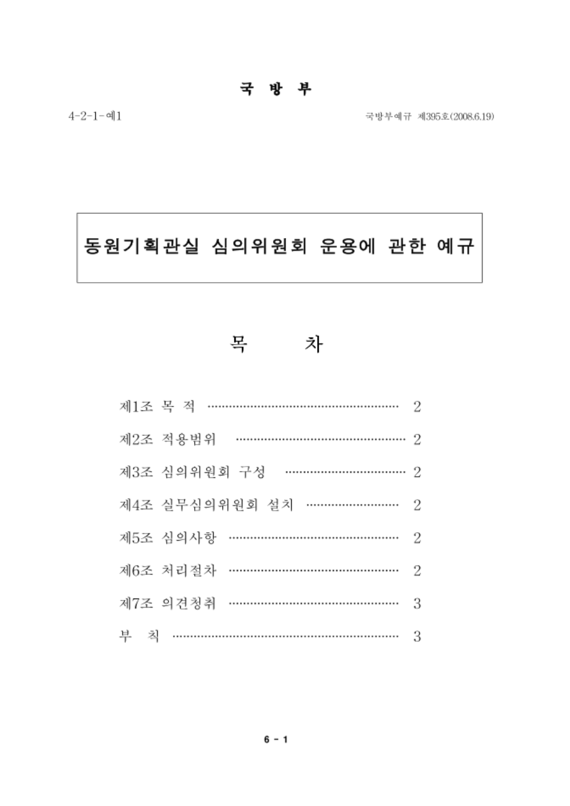
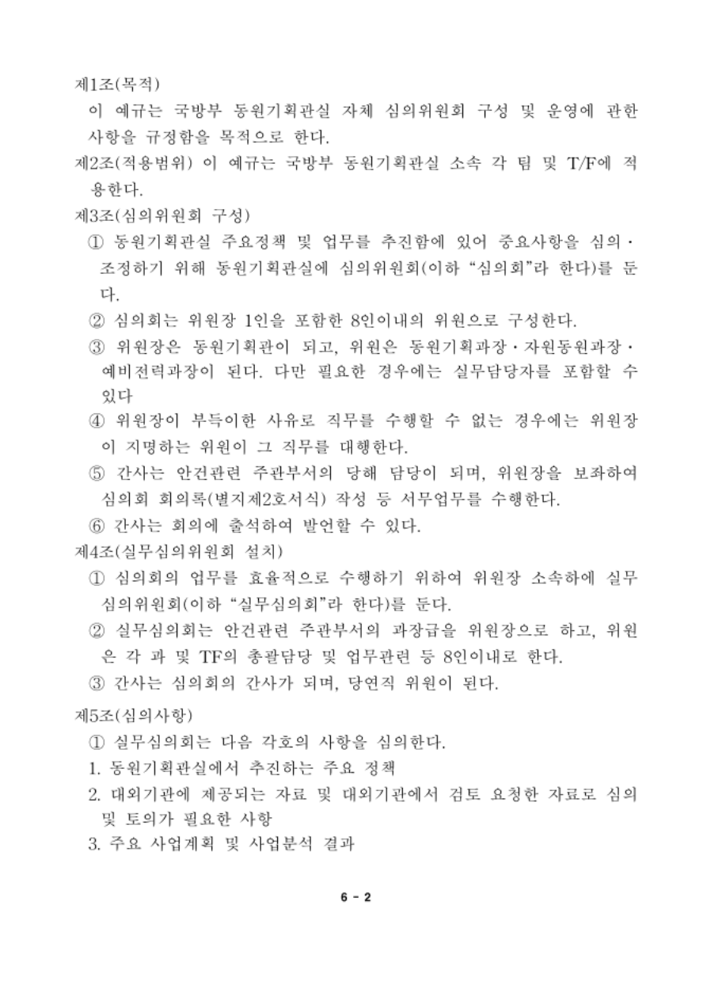
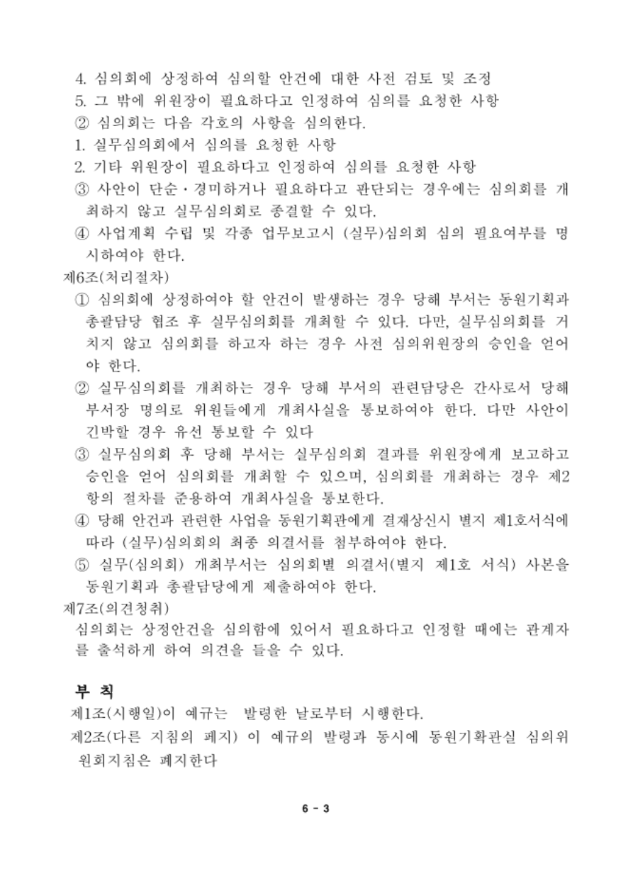
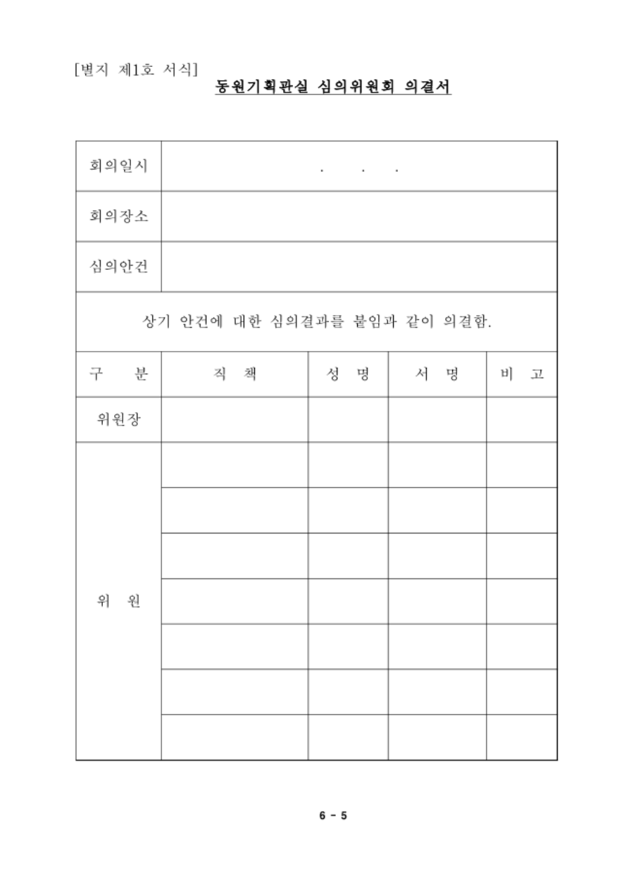
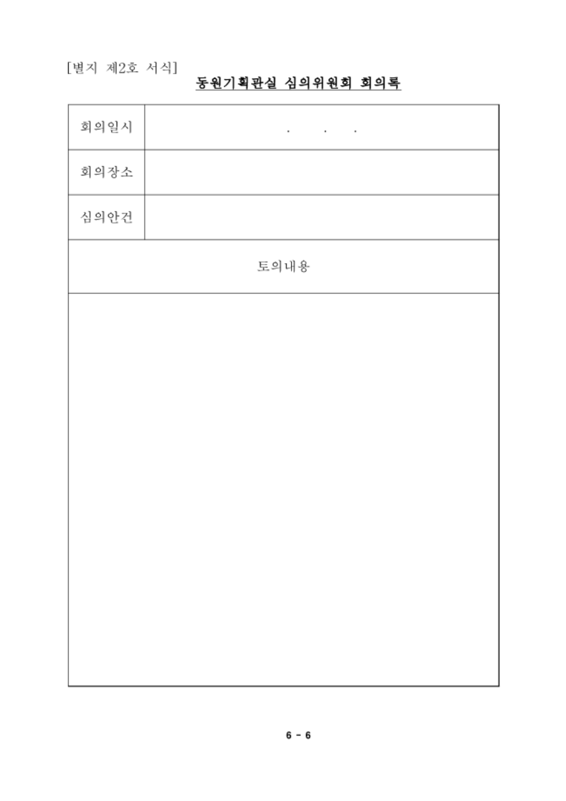

# 동원기획관실 심의위원회 운용에 관한 예규

[공식 원본 PDF](https://law.go.kr/flDownload.do?flSeq=19962113)

원본 SHA-256: `a41fad56e0279d50907e6c3e4e463fb53709bb6d4f84880d22cd9d21a12df24e`

## 변환 범위

- 국방부예규 제395호(2008.6.19)의 6쪽 전사본입니다. 현행 규정 여부를 판정하지 않습니다.
- 1쪽 표지·목차, 2~3쪽 본문 및 부칙, 4쪽 작성관·발령기관, 5~6쪽 별지서식을 구분했습니다.
- 원문 목차는 제6조를 2쪽으로 표시하지만 실제 제6조는 PDF 3쪽에 있습니다. 목차 표기는 그대로 보존했습니다.
- 띄어쓰기·줄바꿈·가운뎃점은 열람용으로 정리했습니다. 제2조 T/F와 제4조 TF는 원문대로 구별했습니다.
- 서식의 빈칸은 기입란으로 표시했습니다. 반복된 빈 위원행은 전사표에서 한 행으로 요약하고 원본 배치는 이미지에 보존했습니다. 채워진 신청·의결 자료가 아닙니다.

## 원문 1쪽

국방부

국방부예규 제395호(2008.6.19)

4-2-1-예1

# 동원기획관실 심의위원회 운용에 관한 예규

## 원문 목차

| 항목 | 원문 목차의 쪽수 |
| --- | --- |
| 제1조 목적 | 2 |
| 제2조 적용범위 | 2 |
| 제3조 심의위원회 구성 | 2 |
| 제4조 실무심의위원회 설치 | 2 |
| 제5조 심의사항 | 2 |
| 제6조 처리절차 | 2 |
| 제7조 의견청취 | 3 |
| 부칙 | 3 |

## 원문 2쪽

## 제1조(목적)

이 예규는 국방부 동원기획관실 자체 심의위원회 구성 및 운영에 관한 사항을 규정함을 목적으로 한다.

## 제2조(적용범위)

이 예규는 국방부 동원기획관실 소속 각 팀 및 T/F에 적용한다.

## 제3조(심의위원회 구성)

① 동원기획관실 주요정책 및 업무를 추진함에 있어 중요사항을 심의·조정하기 위해 동원기획관실에 심의위원회(이하 “심의회”라 한다)를 둔다.

② 심의회는 위원장 1인을 포함한 8인이내의 위원으로 구성한다.

③ 위원장은 동원기획관이 되고, 위원은 동원기획과장·자원동원과장·예비전력과장이 된다. 다만 필요한 경우에는 실무담당자를 포함할 수 있다.

④ 위원장이 부득이한 사유로 직무를 수행할 수 없는 경우에는 위원장이 지명하는 위원이 그 직무를 대행한다.

⑤ 간사는 안건관련 주관부서의 당해 담당이 되며, 위원장을 보좌하여 심의회 회의록(별지제2호서식) 작성 등 서무업무를 수행한다.

⑥ 간사는 회의에 출석하여 발언할 수 있다.

## 제4조(실무심의위원회 설치)

① 심의회의 업무를 효율적으로 수행하기 위하여 위원장 소속하에 실무심의위원회(이하 “실무심의회”라 한다)를 둔다.

② 실무심의회는 안건관련 주관부서의 과장급을 위원장으로 하고, 위원은 각 과 및 TF의 총괄담당 및 업무관련 등 8인이내로 한다.

③ 간사는 심의회의 간사가 되며, 당연직 위원이 된다.

## 제5조(심의사항)

① 실무심의회는 다음 각호의 사항을 심의한다.

1. 동원기획관실에서 추진하는 주요 정책
2. 대외기관에 제공되는 자료 및 대외기관에서 검토 요청한 자료로 심의 및 토의가 필요한 사항
3. 주요 사업계획 및 사업분석 결과

## 원문 3쪽

(제5조제1항 계속)

4. 심의회에 상정하여 심의할 안건에 대한 사전 검토 및 조정
5. 그 밖에 위원장이 필요하다고 인정하여 심의를 요청한 사항

② 심의회는 다음 각호의 사항을 심의한다.

1. 실무심의회에서 심의를 요청한 사항
2. 기타 위원장이 필요하다고 인정하여 심의를 요청한 사항

③ 사안이 단순·경미하거나 필요하다고 판단되는 경우에는 심의회를 개최하지 않고 실무심의회로 종결할 수 있다.

④ 사업계획 수립 및 각종 업무보고시 (실무)심의회 심의 필요여부를 명시하여야 한다.

## 제6조(처리절차)

① 심의회에 상정하여야 할 안건이 발생하는 경우 당해 부서는 동원기획과 총괄담당 협조 후 실무심의회를 개최할 수 있다. 다만, 실무심의회를 거치지 않고 심의회를 하고자 하는 경우 사전 심의위원장의 승인을 얻어야 한다.

② 실무심의회를 개최하는 경우 당해 부서의 관련담당은 간사로서 당해 부서장 명의로 위원들에게 개최사실을 통보하여야 한다. 다만 사안이 긴박할 경우 유선 통보할 수 있다.

③ 실무심의회 후 당해 부서는 실무심의회 결과를 위원장에게 보고하고 승인을 얻어 심의회를 개최할 수 있으며, 심의회를 개최하는 경우 제2항의 절차를 준용하여 개최사실을 통보한다.

④ 당해 안건과 관련한 사업을 동원기획관에게 결재상신시 별지 제1호서식에 따라 (실무)심의회의 최종 의결서를 첨부하여야 한다.

⑤ (실무)심의회 개최부서는 심의회별 의결서(별지 제1호 서식) 사본을 동원기획과 총괄담당에게 제출하여야 한다.

## 제7조(의견청취)

심의회는 상정안건을 심의함에 있어서 필요하다고 인정할 때에는 관계자를 출석하게 하여 의견을 들을 수 있다.

## 부칙

제1조(시행일) 이 예규는 발령한 날로부터 시행한다.

제2조(다른 지침의 폐지) 이 예규의 발령과 동시에 동원기획관실 내 심의회 운영지침은 폐지한다.

## 원문 4쪽

작성관

인사복지실 동원기획관실 동원기획과 동원총괄담당 / 900-5211

국방부장관

## 원문 5쪽

## [별지 제1호 서식]

# 동원기획관실 심의위원회 의결서

회의일시: [기입란]

회의장소: [기입란]

심의안건: [기입란]

상기 안건에 대한 심의결과를 붙임과 같이 의결함.

| 구분 | 직책 | 성명 | 서명 | 비고 |
| --- | --- | --- | --- | --- |
| 위원장 | | | | |
| 위원 | | | | |

> 위원란은 원문에서 여러 기입행으로 나뉘어 있습니다. 아래 원본 이미지에 빈칸과 병합 셀 배치를 보존했습니다.

## 원문 6쪽

## [별지 제2호 서식]

# 동원기획관실 심의위원회 회의록

회의일시: [기입란]

회의장소: [기입란]

심의안건: [기입란]

토의내용: [기입란]

