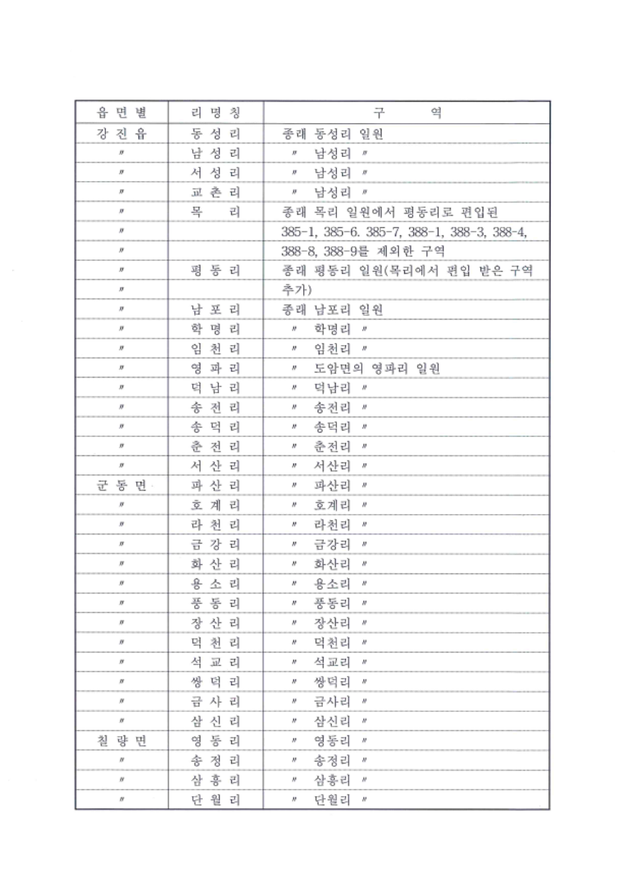
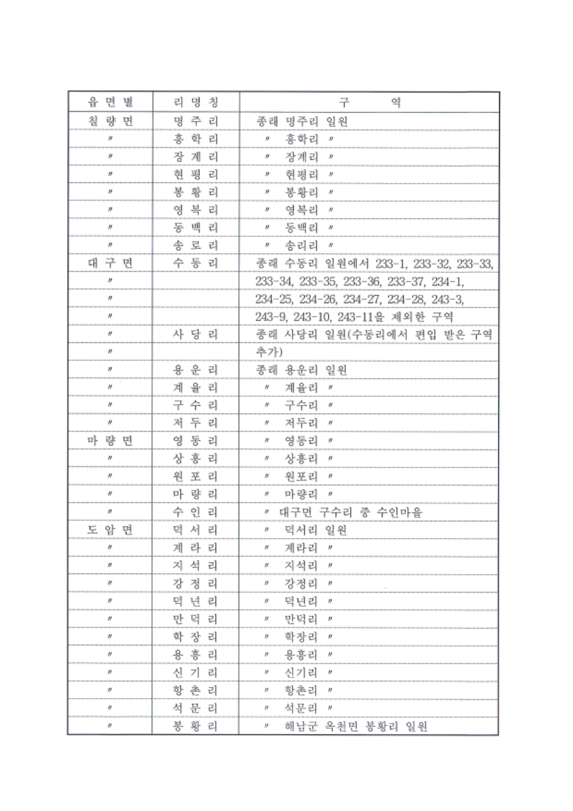
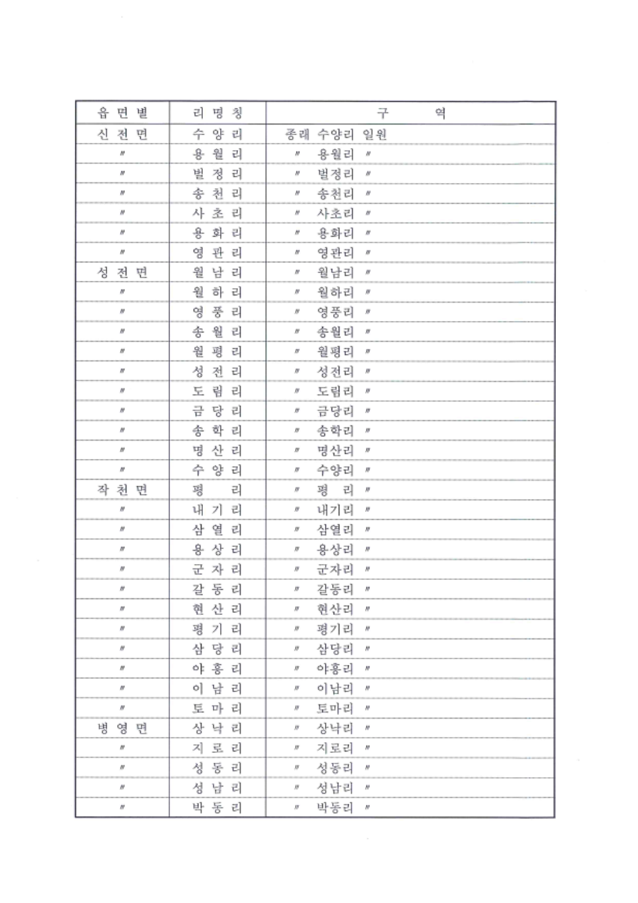
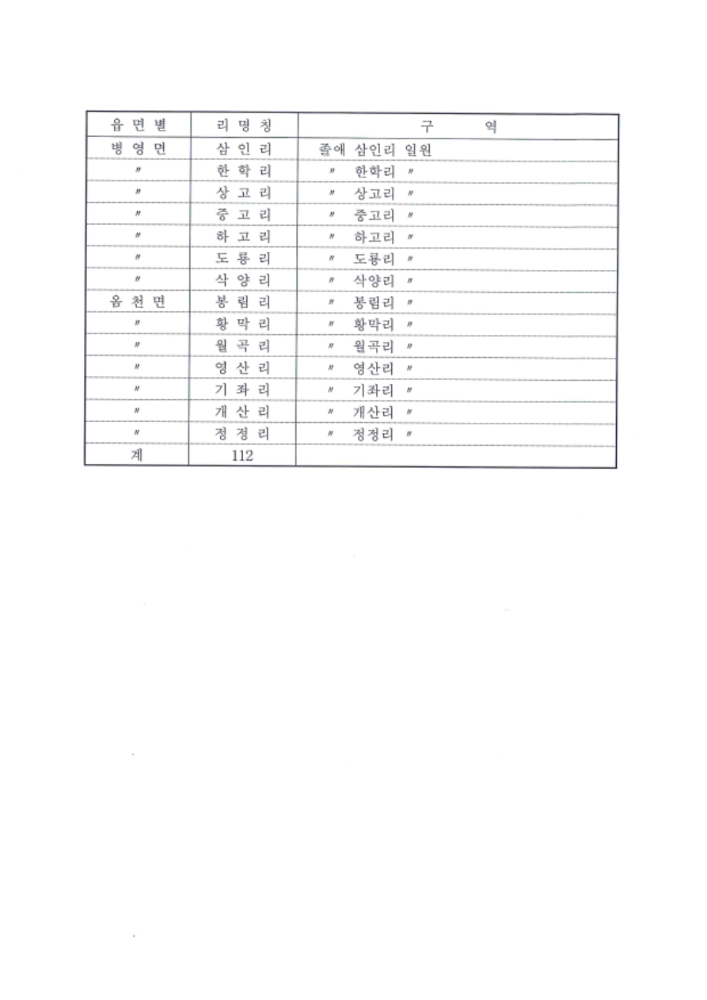

# 강진군 리명칭과 구역에 관한 조례 — 리명칭과 구역

[공식 원본 PDF](https://www.law.go.kr/flDownload.do?gubun=ELIS&flSeq=153863661&flNm=%EB%A6%AC%EB%AA%85%EC%B9%AD%EA%B3%BC+%EA%B5%AC%EC%97%AD)

원본 SHA-256: `f6484816bac46405b3aefa762d2cf0b33c430fa102e7619697d41506fb80e1d1`

## 변환 범위 및 원문 표기

- 조례 본문이 아닌 리 명칭·구역 표 4쪽의 전사본입니다. 현재 행정구역 또는 현행 조례를 판정하지 않습니다.
- 서성리·교촌리 행의 구역 열은 원문대로 남성리, 송로리 행의 구역 열은 원문대로 송리리로 보존했습니다.
- 반복기호는 〃로 통일했습니다. 읍면별 열은 반복기호의 대상을 풀어 적고, 구역 열의 반복기호는 그대로 보존했습니다.
- 지번 및 구역 문구가 여러 줄에 걸친 행은 하나로 합쳤습니다. 이름 사이 공백과 지번 구분 문장부호는 정리했습니다.
- 원문 합계 112는 데이터 행과 분리했습니다. 별도의 각주·조문 본문은 이 PDF에 없습니다.

## 원문 1쪽

| 읍면별 | 리명칭 | 구역 |
| --- | --- | --- |
| 강진읍 | 동성리 | 종래 동성리 일원 |
| 강진읍 | 남성리 | 〃 남성리 〃 |
| 강진읍 | 서성리 | 〃 남성리 〃 |
| 강진읍 | 교촌리 | 〃 남성리 〃 |
| 강진읍 | 목리 | 종래 목리 일원에서 평동리로 편입된 385-1, 385-6, 385-7, 388-1, 388-3, 388-4, 388-8, 388-9를 제외한 구역 |
| 강진읍 | 평동리 | 종래 평동리 일원(목리에서 편입 받은 구역 추가) |
| 강진읍 | 남포리 | 종래 남포리 일원 |
| 강진읍 | 학명리 | 〃 학명리 〃 |
| 강진읍 | 임천리 | 〃 임천리 〃 |
| 강진읍 | 영파리 | 〃 도암면의 영파리 일원 |
| 강진읍 | 덕남리 | 〃 덕남리 〃 |
| 강진읍 | 송전리 | 〃 송전리 〃 |
| 강진읍 | 송덕리 | 〃 송덕리 〃 |
| 강진읍 | 춘전리 | 〃 춘전리 〃 |
| 강진읍 | 서산리 | 〃 서산리 〃 |
| 군동면 | 파산리 | 〃 파산리 〃 |
| 군동면 | 호계리 | 〃 호계리 〃 |
| 군동면 | 라천리 | 〃 라천리 〃 |
| 군동면 | 금강리 | 〃 금강리 〃 |
| 군동면 | 화산리 | 〃 화산리 〃 |
| 군동면 | 용소리 | 〃 용소리 〃 |
| 군동면 | 풍동리 | 〃 풍동리 〃 |
| 군동면 | 장산리 | 〃 장산리 〃 |
| 군동면 | 덕천리 | 〃 덕천리 〃 |
| 군동면 | 석교리 | 〃 석교리 〃 |
| 군동면 | 쌍덕리 | 〃 쌍덕리 〃 |
| 군동면 | 금사리 | 〃 금사리 〃 |
| 군동면 | 삼신리 | 〃 삼신리 〃 |
| 칠량면 | 영동리 | 〃 영동리 〃 |
| 칠량면 | 송정리 | 〃 송정리 〃 |
| 칠량면 | 삼흥리 | 〃 삼흥리 〃 |
| 칠량면 | 단월리 | 〃 단월리 〃 |

## 원문 2쪽

| 읍면별 | 리명칭 | 구역 |
| --- | --- | --- |
| 칠량면 | 명주리 | 종래 명주리 일원 |
| 칠량면 | 홍학리 | 〃 홍학리 〃 |
| 칠량면 | 장계리 | 〃 장계리 〃 |
| 칠량면 | 현평리 | 〃 현평리 〃 |
| 칠량면 | 봉황리 | 〃 봉황리 〃 |
| 칠량면 | 영복리 | 〃 영복리 〃 |
| 칠량면 | 동백리 | 〃 동백리 〃 |
| 칠량면 | 송로리 | 〃 송리리 〃 |
| 대구면 | 수동리 | 종래 수동리 일원에서 233-1, 233-32, 233-33, 233-34, 233-35, 233-36, 233-37, 234-1, 234-25, 234-26, 234-27, 234-28, 243-3, 243-9, 243-10, 243-11을 제외한 구역 |
| 대구면 | 사당리 | 종래 사당리 일원(수동리에서 편입 받은 구역 추가) |
| 대구면 | 용운리 | 종래 용운리 일원 |
| 대구면 | 계율리 | 〃 계율리 〃 |
| 대구면 | 구수리 | 〃 구수리 〃 |
| 대구면 | 저두리 | 〃 저두리 〃 |
| 마량면 | 영동리 | 〃 영동리 〃 |
| 마량면 | 상흥리 | 〃 상흥리 〃 |
| 마량면 | 원포리 | 〃 원포리 〃 |
| 마량면 | 마량리 | 〃 마량리 〃 |
| 마량면 | 수인리 | 〃 대구면 구수리 중 수인마을 |
| 도암면 | 덕서리 | 〃 덕서리 일원 |
| 도암면 | 계라리 | 〃 계라리 〃 |
| 도암면 | 지석리 | 〃 지석리 〃 |
| 도암면 | 강정리 | 〃 강정리 〃 |
| 도암면 | 덕년리 | 〃 덕년리 〃 |
| 도암면 | 만덕리 | 〃 만덕리 〃 |
| 도암면 | 학장리 | 〃 학장리 〃 |
| 도암면 | 용흥리 | 〃 용흥리 〃 |
| 도암면 | 신기리 | 〃 신기리 〃 |
| 도암면 | 항촌리 | 〃 항촌리 〃 |
| 도암면 | 석문리 | 〃 석문리 〃 |
| 도암면 | 봉황리 | 〃 해남군 옥천면 봉황리 일원 |

## 원문 3쪽

| 읍면별 | 리명칭 | 구역 |
| --- | --- | --- |
| 신전면 | 수양리 | 종래 수양리 일원 |
| 신전면 | 용월리 | 〃 용월리 〃 |
| 신전면 | 벌정리 | 〃 벌정리 〃 |
| 신전면 | 송천리 | 〃 송천리 〃 |
| 신전면 | 사초리 | 〃 사초리 〃 |
| 신전면 | 용화리 | 〃 용화리 〃 |
| 신전면 | 영관리 | 〃 영관리 〃 |
| 성전면 | 월남리 | 〃 월남리 〃 |
| 성전면 | 월하리 | 〃 월하리 〃 |
| 성전면 | 영풍리 | 〃 영풍리 〃 |
| 성전면 | 송월리 | 〃 송월리 〃 |
| 성전면 | 월평리 | 〃 월평리 〃 |
| 성전면 | 성전리 | 〃 성전리 〃 |
| 성전면 | 도림리 | 〃 도림리 〃 |
| 성전면 | 금당리 | 〃 금당리 〃 |
| 성전면 | 송학리 | 〃 송학리 〃 |
| 성전면 | 명산리 | 〃 명산리 〃 |
| 성전면 | 수양리 | 〃 수양리 〃 |
| 작천면 | 평리 | 〃 평리 〃 |
| 작천면 | 내기리 | 〃 내기리 〃 |
| 작천면 | 삼열리 | 〃 삼열리 〃 |
| 작천면 | 용상리 | 〃 용상리 〃 |
| 작천면 | 군자리 | 〃 군자리 〃 |
| 작천면 | 갈동리 | 〃 갈동리 〃 |
| 작천면 | 현산리 | 〃 현산리 〃 |
| 작천면 | 평기리 | 〃 평기리 〃 |
| 작천면 | 삼당리 | 〃 삼당리 〃 |
| 작천면 | 야흥리 | 〃 야흥리 〃 |
| 작천면 | 이남리 | 〃 이남리 〃 |
| 작천면 | 토마리 | 〃 토마리 〃 |
| 병영면 | 상낙리 | 〃 상낙리 〃 |
| 병영면 | 지로리 | 〃 지로리 〃 |
| 병영면 | 성동리 | 〃 성동리 〃 |
| 병영면 | 성남리 | 〃 성남리 〃 |
| 병영면 | 박동리 | 〃 박동리 〃 |

## 원문 4쪽

| 읍면별 | 리명칭 | 구역 |
| --- | --- | --- |
| 병영면 | 삼인리 | 종래 삼인리 일원 |
| 병영면 | 한학리 | 〃 한학리 〃 |
| 병영면 | 상고리 | 〃 상고리 〃 |
| 병영면 | 중고리 | 〃 중고리 〃 |
| 병영면 | 하고리 | 〃 하고리 〃 |
| 병영면 | 도룡리 | 〃 도룡리 〃 |
| 병영면 | 삭양리 | 〃 삭양리 〃 |
| 옴천면 | 봉림리 | 〃 봉림리 〃 |
| 옴천면 | 황막리 | 〃 황막리 〃 |
| 옴천면 | 월곡리 | 〃 월곡리 〃 |
| 옴천면 | 영산리 | 〃 영산리 〃 |
| 옴천면 | 기좌리 | 〃 기좌리 〃 |
| 옴천면 | 개산리 | 〃 개산리 〃 |
| 옴천면 | 정정리 | 〃 정정리 〃 |

원문 합계: 112

