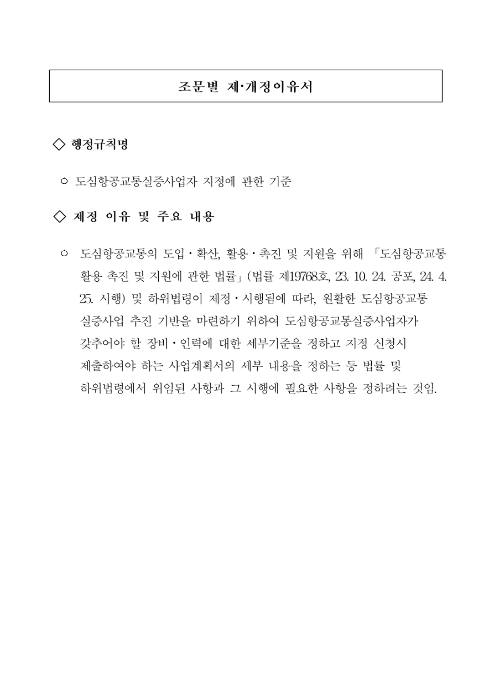

# 조문별 제·개정이유서

> 원문 대조 교정본 · 법령 본문이 아닌 제정 이유 자료입니다.

[공식 원본 PDF](https://law.go.kr/flDownload.do?flSeq=152419241)

원본 SHA-256: `fe2711622de350b1875f0dd40132c212b483e36e2fae9c2c9bfd626782b9a6ff`

## 행정규칙명

도심항공교통실증사업자 지정에 관한 기준

## 제정 이유 및 주요 내용

도심항공교통의 도입·확산, 활용·촉진 및 지원을 위해 「도심항공교통 활용 촉진 및 지원에 관한 법률」 (법률 제19768호, 23. 10. 24. 공포, 24. 4. 25. 시행) 및 하위법령이 제정·시행됨에 따라, 원활한 도심항공교통 실증사업 추진 기반을 마련하기 위하여 도심항공교통실증사업자가 갖추어야 할 장비·인력에 대한 세부기준을 정하고 지정 신청시 제출하여야 하는 사업계획서의 세부 내용을 정하는 등 법률 및 하위법령에서 위임된 사항과 그 시행에 필요한 사항을 정하려는 것임.

## 원본 페이지 1

